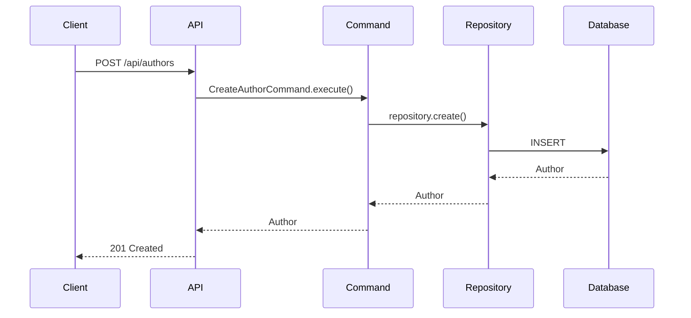
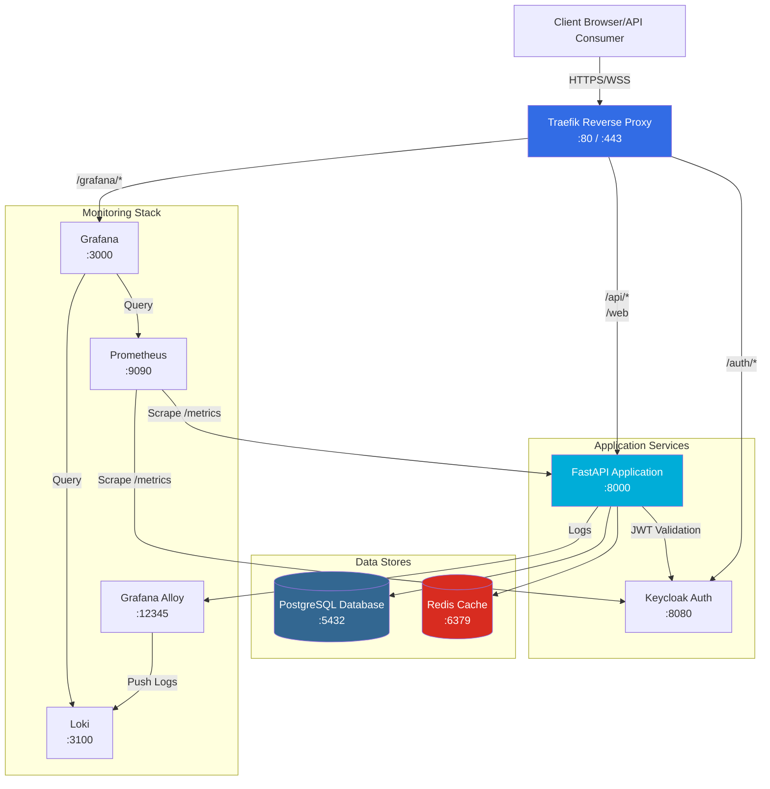

# Project Review & Improvement Recommendations

**Date:** 2025-12-26
**Project:** FastAPI HTTP & WebSocket Application
**Overall Rating:** 9/10 - Production-Ready with Minor Improvements
**Total Lines of Code:** ~7,768 (app directory)
**Test Cases:** 279

---

## Executive Summary

This is a **well-architected, production-ready FastAPI application** demonstrating excellent engineering practices, modern design patterns, comprehensive monitoring, and robust security. The codebase is mature and maintainable with strong foundations for scalability.

---

## Critical Issues (Fix Before Production)

### 1. Remove Debug Print Statements
**Location:** `app/auth.py:117-128`
**Severity:** HIGH (Security Risk)

```python
# REMOVE THESE LINES:
from pprint import pprint
print()
pprint(access_token)
print()
pprint(user_data)
```

**Action:** Remove or wrap in `if settings.DEBUG_AUTH:` conditional.

### 2. Rate Limiter Fail-Open Behavior
**Location:** `app/utils/rate_limiter.py`
**Severity:** MEDIUM (Security/Availability Trade-off)

Currently fails open when Redis is unavailable (allows all requests).

**Recommendation:**
```python
# Add to settings.py
RATE_LIMIT_FAIL_MODE: Literal["open", "closed"] = "open"

# In rate_limiter.py
except RedisError:
    if settings.RATE_LIMIT_FAIL_MODE == "closed":
        return (False, 0)  # Deny request
    return (True, limit)  # Allow request
```

---

## High Priority Improvements

### 3. Database Pagination Performance
**Issue:** Full table counts on every paginated request
**Impact:** Poor performance on large tables

**Current:**
```python
total = (await session.exec(select(func.count()).select_from(model))).one()
```

**Recommendation:**
```python
# Add caching for counts
from functools import lru_cache
from datetime import datetime, timedelta

@lru_cache(maxsize=100)
def get_cached_count(model_name: str, cache_time: datetime):
    # Cache for 5 minutes
    pass

# Or use approximate counts
total = await session.exec(
    select(func.count()).select_from(model).limit(10000)
).one()
```

### 4. Audit Queue Overflow Monitoring
**Issue:** Queue drops logs when full (10k max), no alerting
**Impact:** Silent data loss

**Recommendation:**
```python
# Add Prometheus metric
audit_logs_dropped_total = Counter(
    "audit_logs_dropped_total",
    "Total number of audit logs dropped due to queue full",
)

# Alert when drop rate > 1% in Grafana
expr: rate(audit_logs_dropped_total[5m]) / rate(audit_logs_total[5m]) > 0.01
```

---

## Medium Priority Improvements

### 5. Circuit Breaker Pattern for External Services
**Services:** Keycloak, Redis
**Benefit:** Prevent cascading failures

**Recommendation:**
```python
# Install: uv add pybreaker
from pybreaker import CircuitBreaker

keycloak_breaker = CircuitBreaker(
    fail_max=5,
    timeout_duration=60,
    name="keycloak"
)

@keycloak_breaker
async def validate_token(token: str):
    # Keycloak validation logic
    pass
```

### 6. Security Headers Middleware
**Missing:** CSP, HSTS, X-Frame-Options
**Current:** Only CORS configured

**Recommendation:**
```python
# Add to app/__init__.py
from starlette.middleware.trustedhost import TrustedHostMiddleware
from starlette.middleware.httpsredirect import HTTPSRedirectMiddleware

app.add_middleware(HTTPSRedirectMiddleware)
app.add_middleware(
    TrustedHostMiddleware,
    allowed_hosts=settings.ALLOWED_HOSTS
)

# Add security headers middleware
@app.middleware("http")
async def add_security_headers(request, call_next):
    response = await call_next(request)
    response.headers["X-Frame-Options"] = "DENY"
    response.headers["X-Content-Type-Options"] = "nosniff"
    response.headers["Strict-Transport-Security"] = "max-age=31536000"
    return response
```

### 7. Query Performance Monitoring
**Missing:** Slow query detection and alerting

**Recommendation:**
```python
# Add to database session
from time import time

async def execute_with_timing(session, stmt):
    start = time()
    result = await session.exec(stmt)
    duration = time() - start

    if duration > 0.1:  # 100ms threshold
        logger.warning(f"Slow query: {duration:.2f}s - {stmt}")
        db_slow_queries_total.inc()

    return result
```

### 8. IP Address Spoofing Protection
**Issue:** Trusts `X-Forwarded-For` header
**Risk:** Can be spoofed if not behind trusted proxy

**Recommendation:**
```python
# Add to settings.py
TRUSTED_PROXIES: list[str] = ["10.0.0.0/8", "172.16.0.0/12"]

# In middleware
def get_client_ip(request: Request) -> str:
    forwarded_for = request.headers.get("X-Forwarded-For")
    if forwarded_for and is_trusted_proxy(request.client.host):
        return forwarded_for.split(",")[0].strip()
    return request.client.host
```

---

## Testing Improvements

### 9. WebSocket Load Testing
**Missing:** Load tests for concurrent connections

**Recommendation:**
```python
# Add tests/load/test_websocket_load.py
import asyncio
import websockets

async def test_1000_concurrent_connections():
    """Test 1000 concurrent WebSocket connections."""
    async def connect_client(i):
        async with websockets.connect(f"ws://localhost:8000/web?token={token}"):
            await asyncio.sleep(10)

    await asyncio.gather(*[connect_client(i) for i in range(1000)])
```

### 10. Chaos Engineering Tests
**Missing:** Failure scenario testing

**Recommendation:**
```bash
# Add to tests/chaos/
# Test Redis failure
# Test Database connection loss
# Test Keycloak unavailability
# Test partial network failures
```

---

## Best Practices Observed (Keep Doing!)

### Architecture ✅
- Repository + Command + Dependency Injection pattern
- Protocol abstraction (HTTP/WebSocket unified error handling)
- Format negotiation (JSON/Protobuf)

### Code Quality ✅
- Strict type checking (mypy --strict)
- 80%+ docstring coverage
- PEP 8 compliance (79 char lines)
- Pre-commit hooks (ruff, mypy, bandit, typos)

### Security ✅
- Enterprise-grade auth (Keycloak + JWT)
- RBAC with decorator pattern
- Audit logging with sensitive field redaction
- Rate limiting (Redis sliding window)
- Vulnerability scanning (Bandit + Skjold)

### Monitoring ✅
- Prometheus metrics (HTTP, WebSocket, DB, Redis)
- Grafana dashboards (FastAPI, Keycloak, Audit Logs)
- Loki centralized logging
- Scalene profiling integration

### Testing ✅
- 279 test cases with good isolation
- Repository and command tests
- Migration testing in pre-commit hooks
- Mock-based unit tests

### Documentation ✅
- Comprehensive CLAUDE.md (66KB)
- Module and function docstrings
- Architecture guides with examples
- MkDocs site configured

---

## Performance Optimizations

### Current Strengths ✅
- Database connection pooling (20 + 10 overflow)
- Redis connection pooling (50 max)
- Async/await throughout
- Pagination with skip_count option

### Recommendations

**11. Add Query Result Caching**
```python
from functools import lru_cache
from datetime import datetime, timedelta

class CachedRepository:
    @lru_cache(maxsize=100)
    async def get_frequently_accessed(self, key: str):
        # Cache static/read-only data
        pass
```

**12. Database Query Optimization**
```python
# Add query monitoring
from sqlalchemy import event

@event.listens_for(engine, "before_cursor_execute")
def before_cursor_execute(conn, cursor, statement, params, context, executemany):
    context._query_start_time = time.time()

@event.listens_for(engine, "after_cursor_execute")
def after_cursor_execute(conn, cursor, statement, params, context, executemany):
    duration = time.time() - context._query_start_time
    if duration > 0.1:
        logger.warning(f"Slow query: {duration:.2f}s")
```

---

## Documentation Improvements

### 13. Add Architecture Diagrams
**Missing:** Visual representations of system architecture

**Recommendation:**
```markdown
# Add to docs/architecture/
- SYSTEM_ARCHITECTURE.md - Component diagram
- REQUEST_FLOW.md - Sequence diagrams for HTTP/WebSocket
- DATABASE_SCHEMA.md - ERD diagram
```

Use tools like Mermaid for inline diagrams:


### 14. Deployment Guide
**Missing:** Step-by-step production deployment

**Recommendation:**
Create `docs/deployment/PRODUCTION_DEPLOYMENT.md`:
- Environment setup checklist
- Docker production configuration
- Load balancer configuration
- SSL/TLS setup
- Database migration workflow
- Monitoring setup
- Backup and disaster recovery

---

## Configuration Management

### 15. Environment-Specific Settings
**Current:** Settings in `.env` file
**Recommendation:** Support multiple environments

```python
# Add to settings.py
from enum import Enum

class Environment(str, Enum):
    DEV = "dev"
    STAGING = "staging"
    PRODUCTION = "production"

ENV: Environment = Field(default=Environment.DEV)

# Load environment-specific config
if ENV == Environment.PRODUCTION:
    # Production-specific settings
    DEBUG_AUTH = False
    RATE_LIMIT_FAIL_MODE = "closed"
```

---

## Monitoring Enhancements

### 16. Add Alerting Rules
**Missing:** Prometheus alerting

**Recommendation:**
Create `docker/prometheus/alerts.yml`:
```yaml
groups:
  - name: application
    interval: 30s
    rules:
      - alert: HighErrorRate
        expr: rate(http_requests_total{status_code=~"5.."}[5m]) > 0.05
        annotations:
          summary: "High error rate detected"

      - alert: DatabaseDown
        expr: up{job="postgres"} == 0
        annotations:
          summary: "PostgreSQL is down"

      - alert: AuditLogDropping
        expr: rate(audit_logs_dropped_total[5m]) > 1
        annotations:
          summary: "Audit logs being dropped"
```

### 17. Enhanced Health Checks
**Current:** Basic health check
**Recommendation:** Add readiness and liveness probes

```python
@router.get("/health/liveness")
async def liveness() -> dict:
    """Kubernetes liveness probe - is app running?"""
    return {"status": "alive"}

@router.get("/health/readiness")
async def readiness() -> dict:
    """Kubernetes readiness probe - is app ready to serve traffic?"""
    # Check DB, Redis, critical services
    db_ready = await check_db_ready()
    redis_ready = await check_redis_ready()

    if not (db_ready and redis_ready):
        raise HTTPException(status_code=503, detail="Not ready")

    return {"status": "ready"}
```

---

## Security Hardening

### 18. API Rate Limiting per User
**Current:** Global rate limits
**Enhancement:** Per-user rate limits

```python
# Add to rate_limiter.py
async def check_user_rate_limit(user_id: str) -> bool:
    key = f"rate_limit:user:{user_id}"
    # Different limits per user tier (free, premium, enterprise)
    limit = get_user_tier_limit(user_id)
    return await check_rate_limit(key, limit, window=60)
```

### 19. Request Size Limits
**Missing:** Protection against large payloads

```python
# Add to middleware
app.add_middleware(
    RequestBodySizeLimitMiddleware,
    max_body_size=1024 * 1024  # 1MB
)
```

---

## Code Quality Enhancements

### 20. Resolve TODO Comments
**Found:** `websocket.py:194` - "Try to get original correlation id from header???"

**Action:** Either implement or document decision to defer.

### 21. Add Code Coverage Thresholds
**Missing:** Minimum coverage enforcement

```toml
# Add to pyproject.toml
[tool.coverage.report]
fail_under = 80
exclude_lines = [
    "pragma: no cover",
    "if TYPE_CHECKING:",
    "raise NotImplementedError"
]
```

---

## Testing Infrastructure Improvements (From NOTES)

### 22. Add pytest-xdist for Parallel Test Execution
**Current:** Tests run sequentially (279 tests)
**Benefit:** Faster test execution, better CI/CD performance

**Implementation:**
```bash
# Install pytest-xdist
uv add --group dev pytest-xdist

# Run tests in parallel
pytest -n auto  # Uses all CPU cores
pytest -n 4     # Use 4 workers
```

**Update Makefile:**
```makefile
test:
	uv run pytest -n auto -v

test-serial:
	uv run pytest -v
```

**Expected improvement:** 3-5x faster test execution with parallel workers.

### 23. Simplify Unit Tests and Fixtures
**Current:** Test fixtures spread across multiple files
**Issue:** Code duplication, inconsistent fixture patterns

**Recommendation:**
- Centralize common fixtures in `tests/conftest.py`
- Create fixture factories for reusable test data
- Reduce code duplication in test setup

**Example refactoring:**
```python
# tests/conftest.py
@pytest.fixture
def mock_author_repository():
    """Reusable mock repository fixture."""
    repo = AsyncMock(spec=AuthorRepository)
    repo.get_by_id = AsyncMock(return_value=None)
    repo.get_by_name = AsyncMock(return_value=None)
    repo.create = AsyncMock()
    return repo

@pytest.fixture
def sample_author():
    """Factory for test author instances."""
    return Author(id=1, name="Test Author", bio="Test bio")

@pytest.fixture
def sample_create_author_input():
    """Factory for CreateAuthorInput test data."""
    return CreateAuthorInput(name="New Author", bio="New bio")
```

**Benefits:**
- Reduced test code duplication
- Consistent test data patterns
- Easier test maintenance
- Clearer test intent

### 24. Centralize Test Mocks
**Current:** Mocks defined inline in individual test files
**Issue:** Duplication of mock setup code

**Recommendation:**
Create dedicated mock modules:
```
tests/
├── mocks/
│   ├── __init__.py
│   ├── repository_mocks.py    # Repository mock factories
│   ├── auth_mocks.py           # Auth backend mocks
│   ├── redis_mocks.py          # Redis connection mocks
│   ├── keycloak_mocks.py       # Keycloak client mocks
│   └── websocket_mocks.py      # WebSocket connection mocks
```

**Example implementation:**
```python
# tests/mocks/repository_mocks.py
from unittest.mock import AsyncMock
from app.repositories.author_repository import AuthorRepository

def create_mock_author_repository(**kwargs):
    """Factory for mock AuthorRepository."""
    repo = AsyncMock(spec=AuthorRepository)
    repo.get_by_id = AsyncMock(return_value=kwargs.get('get_by_id_return'))
    repo.create = AsyncMock(return_value=kwargs.get('create_return'))
    return repo

# tests/test_author_commands.py
from tests.mocks.repository_mocks import create_mock_author_repository

async def test_create_author():
    repo = create_mock_author_repository(
        get_by_name_return=None,  # Not exists
        create_return=Author(id=1, name="Test")
    )
    command = CreateAuthorCommand(repo)
    result = await command.execute(input_data)
    assert result.id == 1
```

---

## Documentation Enhancements (From NOTES)

### 25. Monitoring Setup Guide for Worktree Template
**Missing:** Documentation for adding monitoring to new projects generated from template
**Audience:** Developers creating new projects from cookiecutter template

**File to create:** `.worktree/{{cookiecutter.project_slug}}/docs/guides/ADDING_MONITORING.md`

**Contents:**
```markdown
# Adding Monitoring to Your Project

This guide shows how to add Prometheus, Grafana, and Loki to your project.

## Prerequisites
- Docker and Docker Compose installed
- Project generated from template

## Step 1: Add Prometheus
1. Copy `docker/prometheus/` directory from main repo
2. Update `prometheus.yml` with your service endpoints
3. Add to docker-compose.yml...

## Step 2: Configure Grafana
1. Copy `docker/grafana/` directory
2. Import dashboard JSON files
3. Configure data sources...

## Step 3: Set up Loki Logging
1. Copy `docker/loki/` and `docker/grafana-alloy/` directories
2. Configure logging pipeline
3. Update application logging config...

## Step 4: Verify Setup
- Access Grafana: http://localhost:3000
- Check Prometheus targets: http://localhost:9090/targets
- View application logs in Grafana
```

### 26. Docker Services Architecture Diagram
**Missing:** Visual representation of Docker service connections with Traefik proxy
**Benefit:** Better understanding of service topology and routing

**File to create:** `docs/architecture/DOCKER_SERVICES.md`

**Contents with Mermaid diagram:**
```markdown
# Docker Services Architecture

## Service Topology



## Port Mappings

| Service | Internal Port | External Port | Traefik Path |
|---------|---------------|---------------|--------------|
| FastAPI | 8000 | - | `/api/*`, `/web` |
| Keycloak | 8080 | 9999 | `/auth/*` |
| PostgreSQL | 5432 | 5433 | - |
| Redis | 6379 | 6380 | - |
| Prometheus | 9090 | 9090 | - |
| Grafana | 3000 | 3000 | `/grafana/*` |
| Loki | 3100 | - | - |
| Grafana Alloy | 12345 | 12345 | - |
| Traefik Dashboard | 8080 | 8080 | `/dashboard/` |

## Network Configuration

All services run on the `hw-network` Docker network with Traefik as the edge proxy.
```

### 27. Update Prometheus to Use Traefik Paths
**Current:** Prometheus scrapes services directly on internal ports
**Improvement:** Use Traefik reverse proxy for consistent routing

**File:** `docker/prometheus/prometheus.yml`

**Current configuration:**
```yaml
scrape_configs:
  - job_name: 'fastapi-app'
    static_configs:
      - targets: ['hw-server-shell:8000']
    metrics_path: '/metrics'
```

**Improved configuration with Traefik:**
```yaml
global:
  scrape_interval: 15s
  evaluation_interval: 15s

scrape_configs:
  # Application metrics via Traefik
  - job_name: 'fastapi-app'
    static_configs:
      - targets: ['traefik:80']
    metrics_path: '/metrics'
    params:
      service: ['fastapi']
    relabel_configs:
      - source_labels: [__address__]
        target_label: instance
        replacement: 'fastapi-app'

  # Keycloak metrics via Traefik
  - job_name: 'keycloak'
    static_configs:
      - targets: ['traefik:80']
    metrics_path: '/auth/metrics'
    relabel_configs:
      - source_labels: [__address__]
        target_label: instance
        replacement: 'keycloak'

  # Prometheus self-monitoring
  - job_name: 'prometheus'
    static_configs:
      - targets: ['localhost:9090']

  # Traefik metrics
  - job_name: 'traefik'
    static_configs:
      - targets: ['traefik:8080']
    metrics_path: '/metrics'
```

**Benefits:**
- Consistent routing through Traefik
- Better SSL/TLS handling in production
- Centralized access control
- Easier service discovery

---

## FastAPI Modernization (From NOTES)

### 28. Migrate to Lifespan Context Manager
**Current:** Using deprecated `@app.on_event("startup")` and `@app.on_event("shutdown")`
**Issue:** These decorators are deprecated in FastAPI 0.109+
**Benefit:** Modern pattern, better resource management, FastAPI recommendation

**Current implementation (`app/__init__.py`):**
```python
@app.on_event("startup")  # Deprecated
async def startup_event():
    await wait_and_init_db()
    tasks.append(asyncio.create_task(kc_user_session_task()))
    tasks.append(asyncio.create_task(audit_log_writer()))

@app.on_event("shutdown")  # Deprecated
async def shutdown_event():
    for task in tasks:
        task.cancel()
    await asyncio.gather(*tasks, return_exceptions=True)
```

**Modern lifespan implementation:**
```python
from contextlib import asynccontextmanager

@asynccontextmanager
async def lifespan(app: FastAPI):
    """
    FastAPI lifespan context manager for startup and shutdown.

    Handles:
    - Database initialization with retries
    - Background task startup
    - Graceful shutdown with task cancellation
    """
    # Startup
    logger.info("Application startup: initializing resources")

    # Initialize database
    await wait_and_init_db()

    # Start background tasks
    background_tasks = [
        asyncio.create_task(kc_user_session_task(), name="kc_session_sync"),
        asyncio.create_task(audit_log_writer(), name="audit_writer"),
    ]

    logger.info(f"Started {len(background_tasks)} background tasks")

    yield  # Application runs here

    # Shutdown
    logger.info("Application shutdown: cleaning up resources")

    # Cancel background tasks
    for task in background_tasks:
        if not task.done():
            task.cancel()

    # Wait for tasks to complete cancellation
    await asyncio.gather(*background_tasks, return_exceptions=True)

    logger.info("Application shutdown complete")

# Create FastAPI app with lifespan
app = FastAPI(
    title=app_settings.PROJECT_NAME,
    version="1.0.0",
    lifespan=lifespan,  # Use lifespan instead of event handlers
)
```

**Benefits:**
- Modern FastAPI pattern (recommended since 0.109)
- Better resource management with context manager
- Clearer startup/shutdown flow
- Proper exception handling during shutdown
- Type-safe with better IDE support

**Migration steps:**
1. Remove `@app.on_event("startup")` and `@app.on_event("shutdown")` decorators
2. Implement `lifespan()` async context manager
3. Move startup logic before `yield`
4. Move shutdown logic after `yield`
5. Update `FastAPI()` constructor with `lifespan=lifespan`
6. Test startup and shutdown behavior

---

## Deployment Checklist

Before deploying to production:

**Critical Fixes:**
- [ ] Remove debug print statements (`app/auth.py:117-128`)
- [ ] Configure rate limiter fail mode (settings.py)
- [ ] Migrate to FastAPI lifespan pattern (deprecation fix)

**Security Enhancements:**
- [ ] Add security headers middleware (HSTS, CSP, X-Frame-Options)
- [ ] Configure trusted proxy list for IP validation
- [ ] Enable HTTPS/TLS with valid certificates
- [ ] Review and test RBAC permissions

**Monitoring & Observability:**
- [ ] Set up Prometheus alerting rules
- [ ] Configure environment-specific settings
- [ ] Set up Grafana dashboards
- [ ] Configure log retention policies
- [ ] Test audit log queue monitoring

**Testing & Quality:**
- [ ] Run load tests (1000+ concurrent WebSocket connections)
- [ ] Test failure scenarios (chaos engineering)
- [ ] Add pytest-xdist for parallel test execution
- [ ] Review and resolve all TODO comments
- [ ] Enforce code coverage thresholds (80%)

**Infrastructure:**
- [ ] Set up database backups and retention
- [ ] Update Prometheus to use Traefik paths
- [ ] Create Docker services architecture diagram
- [ ] Document deployment procedures
- [ ] Create incident response playbook

**Documentation:**
- [ ] Add monitoring setup guide for worktree template
- [ ] Document all custom configurations
- [ ] Update API documentation

---

## Strengths to Maintain

This project excels at:

1. **Modern Architecture** - Repository + Command + DI pattern is exemplary
2. **Type Safety** - Comprehensive type hints with mypy --strict
3. **Protocol Abstraction** - Unified error handling across HTTP/WebSocket
4. **Security** - Enterprise-grade auth, RBAC, audit logging
5. **Monitoring** - Prometheus, Grafana, Loki, Scalene profiling
6. **Testing** - 279 tests with good isolation
7. **Documentation** - Exceptional CLAUDE.md with examples
8. **Code Quality** - Pre-commit hooks ensure consistency
9. **Database Migrations** - Alembic with migration testing
10. **Async Best Practices** - Proper async/await, graceful shutdown

**Keep doing these!** This is a reference-quality implementation.

---

## Conclusion

**Overall Assessment:** This is a **high-quality, production-ready application** with excellent engineering practices. The issues identified are minor and easily addressable. The codebase demonstrates maturity, thoughtful design, and strong foundations for scaling.

**Recommended Next Steps:**
1. Address critical issues (debug statements, rate limiter config)
2. Implement high-priority improvements (pagination caching, circuit breaker)
3. Add load testing and chaos engineering
4. Enhance monitoring with alerting rules
5. Create production deployment guide

This project serves as an **excellent reference implementation** for FastAPI applications with WebSocket support, modern design patterns, and production-grade infrastructure.

---

**Reviewed by:** Claude Sonnet 4.5 via Claude Code
**Date:** 2025-12-26
