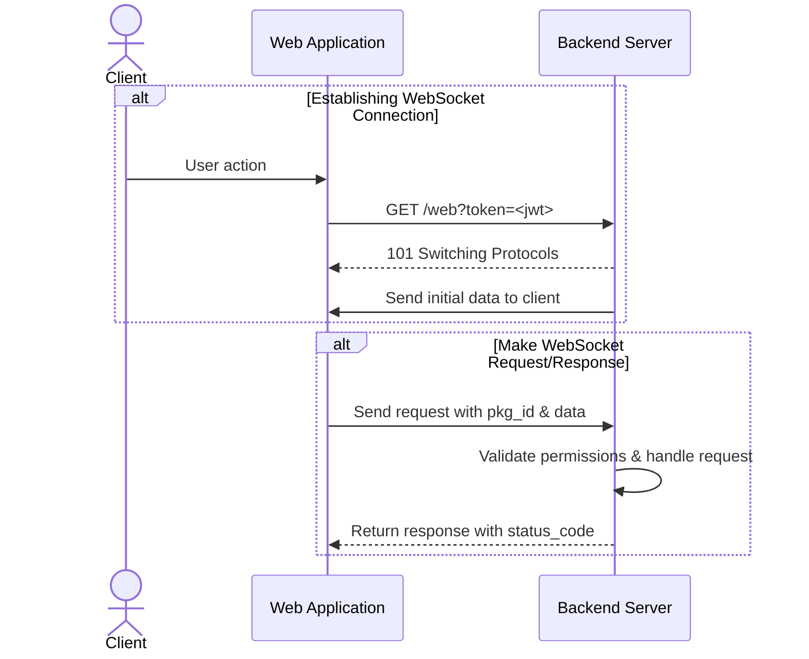

# FastAPI HTTP & WebSocket Application

A production-ready FastAPI application implementing both HTTP REST API and WebSocket handlers with role-based access control (RBAC), Keycloak authentication, and PostgreSQL database integration.

## Table of Contents

- [Features](#features)
- [Prerequisites](#prerequisites)
- [Quick Start](#quick-start)
- [Installation](#installation)
- [Documentation](#documentation)
- [Configuration](#configuration)
- [Usage](#usage)
  - [HTTP API](#http-api)
  - [WebSocket API](#websocket-api)
- [Architecture Overview](#architecture-overview)
- [API Reference](#api-reference)
- [Development](#development)
- [Testing](#testing)
- [Troubleshooting](#troubleshooting)
- [Contributing](#contributing)
- [License](#license)

## Features

- **Dual Protocol Support**: HTTP REST API and WebSocket real-time communication
- **Authentication**: Keycloak-based JWT token authentication
- **Authorization**: Fine-grained RBAC with role-based permissions
- **Rate Limiting**: Redis-based sliding window rate limiting for HTTP and WebSocket
- **Monitoring**: Comprehensive Prometheus metrics with Grafana dashboards
- **Database**: PostgreSQL with async SQLModel/SQLAlchemy
- **Caching**: Redis integration for session management
- **Package Router**: Custom routing system for WebSocket request handling
- **Type Safety**: Strict type checking with mypy
- **Code Quality**: Pre-commit hooks with ruff, bandit, and security scanning
- **Production Ready**: Docker containerization with health checks

## Prerequisites

- **Python**: 3.13+ (specified in [pyproject.toml:6](pyproject.toml#L6))
- **uv**: Modern Python package manager ([installation guide](https://github.com/astral-sh/uv))
- **Docker & Docker Compose**: For containerized services
- **PostgreSQL**: 14+ (provided via Docker)
- **Redis**: 7+ (provided via Docker)
- **Keycloak**: Authentication server (provided via Docker)

## Quick Start

```bash
# 1. Clone the repository
git clone <repository-url>
cd fastapi-http-websocket

# 2. Set up environment variables
cp .env.example .env  # Edit with your configuration

# 3. Start all services (PostgreSQL, Redis, Keycloak)
make start

# 4. Install dependencies and run database migrations
uv sync
make migrate  # If migrations exist

# 5. Start the development server with hot-reload
make serve
```

The application will be available at `http://localhost:8000`

## Installation

### Local Development Setup

```bash
# Install uv package manager (if not already installed)
curl -LsSf https://astral.sh/uv/install.sh | sh

# Install project dependencies
uv sync

# Install pre-commit hooks
uv run pre-commit install
```

### Docker Setup

```bash
# Build all containers
make build

# Start services in detached mode
make start

# View logs
docker-compose logs -f

# Stop services
make stop

# Enter development shell
make shell
```

## Configuration

### Environment Variables

Create a `.env` file in the project root with the following variables:

```bash
# Keycloak Configuration
KEYCLOAK_BASE_URL=http://localhost:8080
KEYCLOAK_REALM=your-realm
KEYCLOAK_CLIENT_ID=your-client-id
KEYCLOAK_ADMIN_USERNAME=admin
KEYCLOAK_ADMIN_PASSWORD=admin

# Database Configuration
POSTGRES_HOST=localhost
POSTGRES_PORT=5432
POSTGRES_DB=your_database
POSTGRES_USER=your_user
POSTGRES_PASSWORD=your_password

# Redis Configuration
REDIS_IP=localhost
REDIS_PORT=6379
MAIN_REDIS_DB=0
AUTH_REDIS_DB=1

# Application Configuration
ACTIONS_FILE_PATH=actions.json  # RBAC permissions file
LOG_LEVEL=INFO
```

### RBAC Configuration

Define role-based permissions in `actions.json`:

```json
{
    "roles": [
        "admin",
        "user",
        "guest"
    ],
    "ws": {
        "1": "user",
        "2": "admin"
    },
    "http": {
        "/api/authors": {
            "GET": "user",
            "POST": "admin"
        }
    }
}
```

## Usage

### HTTP API

#### Authentication

All HTTP requests (except excluded paths) require Bearer token authentication:

```bash
# Login to get access token
curl -X POST http://localhost:8000/auth/login \
  -H "Content-Type: application/json" \
  -d '{"username": "user", "password": "password"}'

# Use token in subsequent requests
curl -X GET http://localhost:8000/api/authors \
  -H "Authorization: Bearer <your-token>"
```

#### Available Endpoints

- `GET /health` - Health check endpoint
- `GET /api/authors` - Get authors list
- `POST /api/authors` - Create new author (requires admin role)

See [app/api/http/](app/api/http/) for all available HTTP endpoints.

### WebSocket API

#### Establishing Connection

```javascript
// Connect with authentication token
const ws = new WebSocket('ws://localhost:8000/web?token=<your-jwt-token>');

ws.onopen = () => {
    console.log('Connected to WebSocket');
};

ws.onmessage = (event) => {
    const response = JSON.parse(event.data);
    console.log('Received:', response);
};
```

#### Request Format

```json
{
    "pkg_id": 1,
    "req_id": "550e8400-e29b-41d4-a716-446655440000",
    "data": {}
}
```

**Paginated Request:**
```json
{
    "pkg_id": 2,
    "req_id": "550e8400-e29b-41d4-a716-446655440000",
    "data": {
        "page": 1,
        "per_page": 20
    }
}
```

*Note: If pagination params are omitted, defaults are `page=1` and `per_page=20`*

#### Response Format

**Regular Response:**
```json
{
    "pkg_id": 1,
    "req_id": "550e8400-e29b-41d4-a716-446655440000",
    "status_code": 0,
    "data": {...}
}
```

**Paginated Response:**
```json
{
    "pkg_id": 2,
    "req_id": "550e8400-e29b-41d4-a716-446655440000",
    "status_code": 0,
    "meta": {
        "page": 1,
        "per_page": 20,
        "total": 45,
        "pages": 3
    },
    "data": [...]
}
```

#### WebSocket Flow Diagram



## Architecture Overview

### Request Flow

**HTTP Requests:**
1. Request hits FastAPI endpoint
2. `AuthenticationMiddleware` authenticates user via Keycloak token
3. `PermAuthHTTPMiddleware` checks RBAC permissions against `actions.json`
4. Request reaches endpoint handler in [app/api/http/](app/api/http/)

**WebSocket Requests:**
1. Client connects to `/web` with JWT token in query params
2. `PackageAuthWebSocketEndpoint` authenticates the connection
3. Client sends JSON with `pkg_id`, `req_id`, and `data`
4. `PackageRouter` validates permissions, validates data schema, and dispatches to handler
5. Handler returns `ResponseModel` sent back to client

### Core Components

#### PackageRouter

Central routing system for WebSocket requests defined in [app/routing.py](app/routing.py):

```python
# Register a handler
@pkg_router.register(PkgID.GET_AUTHORS, json_schema=AuthorSchema)
async def get_authors_handler(request: RequestModel) -> ResponseModel:
    # Handler logic
    return ResponseModel.success(request.pkg_id, request.req_id, data=[...])
```

**Features:**
- Dynamic handler registration using decorators
- Optional JSON schema validation
- Built-in permission checking
- Type-safe request/response models

#### Authentication Backend

[app/auth.py](app/auth.py) - Keycloak JWT token validation:
- Decodes JWT tokens from Authorization header (HTTP) or query string (WebSocket)
- Extracts user data into `UserModel` with roles
- Configurable excluded paths via `EXCLUDED_PATHS` regex

#### RBAC Manager

[app/managers/rbac_manager.py](app/managers/rbac_manager.py) - Singleton permission manager:
- Loads role definitions from `actions.json`
- `check_ws_permission(pkg_id, user)` - Validates WebSocket permissions
- `check_http_permission(request)` - Validates HTTP permissions

#### Keycloak Manager

[app/managers/keycloak_manager.py](app/managers/keycloak_manager.py) - Singleton Keycloak client:
- Manages `KeycloakAdmin` and `KeycloakOpenID` clients
- `login(username, password)` - Returns access token
- Configured via environment variables

#### WebSocket Connection Manager

[app/managers/websocket_connection_manager.py](app/managers/websocket_connection_manager.py):
- Manages active WebSocket connections
- `broadcast(message)` - Sends message to all connected clients
- Connection lifecycle tracking with logging

#### Database

[app/storage/db.py](app/storage/db.py) - PostgreSQL with async SQLModel:
- `get_paginated_results(model, page, per_page, filters=...)` - Pagination helper
- Custom filter functions via `apply_filters` parameter
- Automatic retry logic in `wait_and_init_db()`

### Directory Structure

```
app/
├── __init__.py                 # Application factory
├── api/
│   ├── http/                   # HTTP endpoint routers
│   │   ├── author.py
│   │   └── health.py
│   └── ws/
│       ├── consumers/          # WebSocket endpoint classes
│       ├── handlers/           # WebSocket request handlers
│       └── constants.py        # PkgID and RSPCode enums
├── managers/                   # Singleton managers
│   ├── rbac_manager.py
│   ├── keycloak_manager.py
│   └── websocket_connection_manager.py
├── middlewares/                # Custom middleware
├── models/                     # SQLModel database models
├── schemas/                    # Pydantic validation schemas
├── tasks/                      # Background tasks
└── storage/                    # Database and Redis utilities
```

## API Reference

### WebSocket Package IDs

Available `PkgID` values defined in [app/api/ws/constants.py](app/api/ws/constants.py):

| PkgID | Value | Description | Required Role |
|-------|-------|-------------|---------------|
| `GET_AUTHORS` | 1 | Retrieve author list | `user` |
| `GET_PAGINATED_AUTHORS` | 2 | Retrieve paginated authors | `admin` |
| `THIRD` | 3 | Reserved for future use | TBD |

### Response Status Codes

`RSPCode` enumeration in [app/api/ws/constants.py:4-30](app/api/ws/constants.py#L4-L30):

| Code | Value | Description |
|------|-------|-------------|
| `OK` | 0 | Operation completed successfully |
| `ERROR` | 1 | General error occurred |
| `INVALID_DATA` | 2 | Provided data is invalid or malformed |
| `PERMISSION_DENIED` | 3 | User lacks required permissions |

### Creating New WebSocket Handlers

```bash
# Add new PkgID to app/api/ws/constants.py
# Then generate handler from template
make new-ws-handlers

# Or manually create in app/api/ws/handlers/
```

See [CLAUDE.md](CLAUDE.md#websocket-handler-management) for detailed instructions.

## Development

For comprehensive development workflows, commands, and best practices, see **[CLAUDE.md](CLAUDE.md)**.

### Common Commands

```bash
# Start development server with hot-reload
make serve

# Run tests
uv run pytest

# Run single test
uv run pytest tests/test_check.py::test_function_name

# Code quality checks
make ruff-check          # Linting
uvx ruff format          # Formatting
uvx mypy app/            # Type checking
uvx interrogate app/     # Docstring coverage (≥80%)

# Security scanning
make bandit-scan         # SAST scanning
make skjold-scan         # Dependency vulnerabilities
make dead-code-scan      # Find unused code

# WebSocket handlers
make ws-handlers         # Show PkgID table
make new-ws-handlers     # Generate new handler
```

### Pre-commit Hooks

All commits must pass:
- **ruff**: Linting and formatting (79 char line length)
- **mypy**: Strict type checking
- **interrogate**: ≥80% docstring coverage
- **typos**: Spell checking
- **bandit**: Security scanning (low severity threshold)
- **skjold**: Dependency vulnerability checks

### Code Style Requirements

- **Line length**: 79 characters
- **Type hints**: Required on all functions (mypy --strict)
- **Docstrings**: Required on all public functions, classes, and methods
- **Formatting**: Double quotes, 4-space indentation

## Testing

```bash
# Run all tests with coverage
uv run pytest

# Run with verbose output
uv run pytest -v

# Run specific test file
uv run pytest tests/test_routing.py

# Run with asyncio debug mode
uv run pytest --log-cli-level=DEBUG
```

Tests use:
- `pytest-asyncio` with `asyncio_mode = "auto"`
- `pytest-mock` for mocking Keycloak interactions
- Isolated database sessions for database tests

## Troubleshooting

### Common Issues

#### Connection Refused Errors

**Problem**: `Connection refused` when connecting to services

**Solution**:
```bash
# Verify services are running
docker-compose ps

# Restart services
make stop
make start

# Check logs for errors
docker-compose logs -f
```

#### Keycloak Authentication Failures

**Problem**: `401 Unauthorized` or invalid token errors

**Solutions**:
1. Verify Keycloak is running: `curl http://localhost:8080`
2. Check realm and client configuration in `.env`
3. Ensure token hasn't expired (tokens have limited lifetime)
4. Verify user has required roles in Keycloak admin console

#### Database Migration Issues

**Problem**: Database schema out of sync

**Solutions**:
```bash
# Reset database (WARNING: destroys data)
docker-compose down -v
make start

# Or manually run migrations
uv run alembic upgrade head
```

#### WebSocket Connection Drops

**Problem**: WebSocket connections disconnect unexpectedly

**Solutions**:
1. Check token validity in query parameters
2. Verify user has permissions for requested `pkg_id` in `actions.json`
3. Check server logs for permission denied errors
4. Ensure Redis is running for session management

#### Import Errors

**Problem**: `ModuleNotFoundError` when running the application

**Solutions**:
```bash
# Reinstall dependencies
uv sync

# Clear Python cache
find . -type d -name "__pycache__" -exec rm -rf {} +
find . -type f -name "*.pyc" -delete
```

#### Pre-commit Hook Failures

**Problem**: Commits blocked by pre-commit hooks

**Solutions**:
```bash
# Run individual hooks to identify issues
uvx ruff check --config=pyproject.toml  # Linting
uvx mypy app/                            # Type checking
uvx interrogate app/                     # Docstrings

# Auto-fix formatting issues
uvx ruff format
```

### Getting Help

- Check application logs: `docker-compose logs -f`
- Enable debug logging: Set `LOG_LEVEL=DEBUG` in `.env`
- Review [CLAUDE.md](CLAUDE.md) for detailed development guidance
- Check Keycloak admin console: `http://localhost:8080/admin`

## Contributing

### Development Workflow

1. Create a feature branch from `main`
2. Make your changes following code style requirements
3. Ensure all pre-commit hooks pass
4. Write tests for new functionality
5. Update documentation if needed
6. Submit a pull request to `main` branch

### Code Standards

- All code must pass pre-commit hooks (ruff, mypy, interrogate, etc.)
- Minimum 80% docstring coverage required
- Type hints required on all functions
- Follow 79-character line length limit
- Write tests for new features and bug fixes

### Security

- Never commit sensitive data (`.env` files, tokens, passwords)
- Run security scans before submitting PR: `make bandit-scan && make skjold-scan`
- Report security vulnerabilities privately to maintainers

## License

This project is licensed under the MIT License - see the LICENSE file for details.

---

**Built with**: FastAPI, PostgreSQL, Redis, Keycloak, and modern Python tooling

## Documentation

### 📚 Complete Documentation

All project documentation is organized in the [`docs/`](docs/) directory:

#### Getting Started
- **[Authentication Quick Start](docs/guides/QUICKSTART_AUTH.md)** - Get tokens and start making requests
- **[Database Migrations](docs/DATABASE_MIGRATIONS.md)** - Complete guide to Alembic migrations
- **[Testing Guide](docs/guides/TESTING.md)** - How to test the application
- **[Monitoring Setup](MONITORING.md)** - Prometheus & Grafana monitoring guide

#### In-Depth Guides
- **[Authentication Guide](docs/guides/AUTHENTICATION.md)** - Complete guide to Keycloak authentication
- **[Architecture Overview](docs/architecture/OVERVIEW.md)** - System architecture and design

#### Planning & Improvements
- **[Codebase Improvements](docs/improvements/CODEBASE_IMPROVEMENTS.md)** - Comprehensive improvement report (58 issues)
- **[RBAC Alternatives](docs/architecture/RBAC_ALTERNATIVES.md)** - Permission system design options

#### For Contributors
- **[CLAUDE.md](CLAUDE.md)** - Development guidelines and project structure

### 🎯 Quick Links

**Need a token?** → [Quick Start](docs/guides/QUICKSTART_AUTH.md)
**Testing endpoints?** → [Testing Guide](docs/guides/TESTING.md)
**Understanding the code?** → [Architecture](docs/architecture/OVERVIEW.md)
**Want to contribute?** → [CLAUDE.md](CLAUDE.md)

