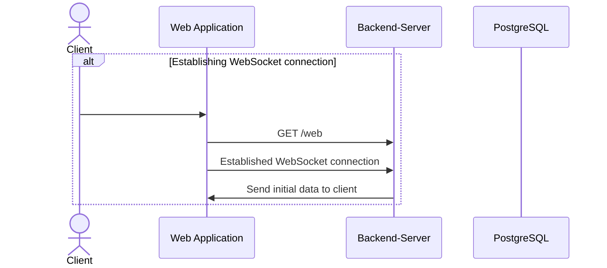
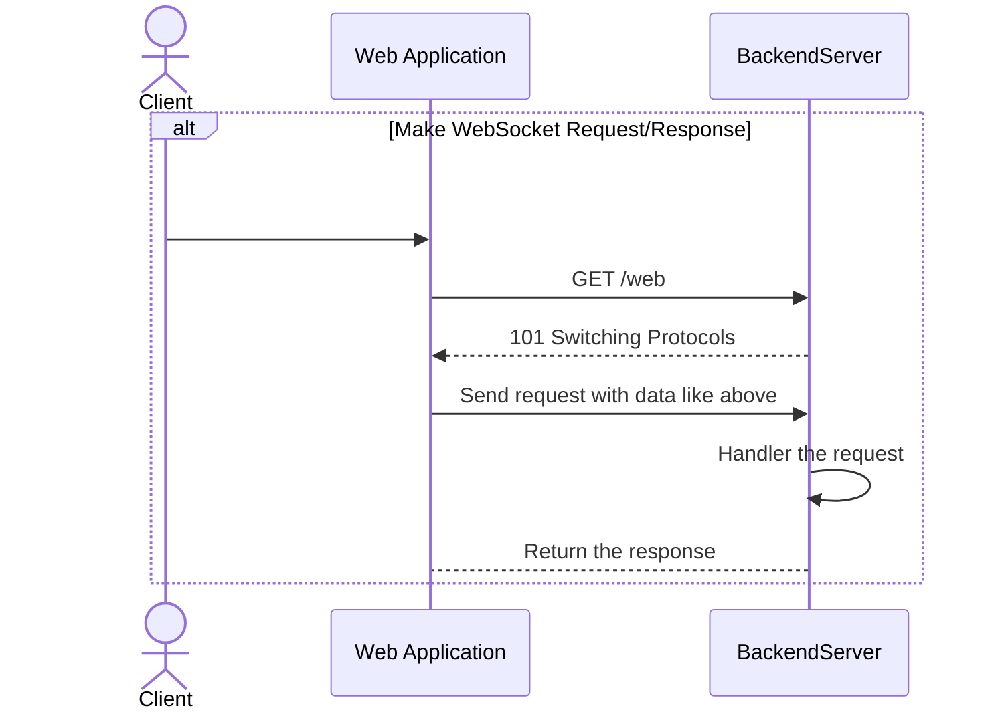
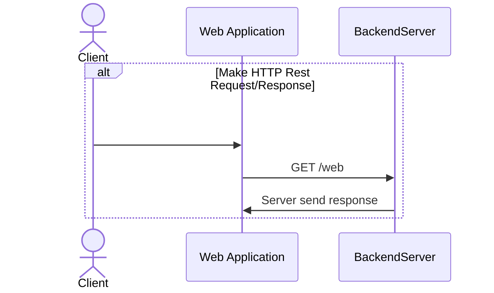

# Authentication and Authorization
## Overview

**Authentication** and **Authorization** are critical components in any secure web application:

- **Authentication** ensures that users are who they claim to be, typically using credentials like username and password or tokens.
- **Authorization** determines what actions authenticated users are permitted to perform based on their roles or permissions.

This FastAPI implementation leverages middleware and custom backends to handle both authentication and authorization seamlessly.
## Implementation Details

### Authentication

Authentication is handled by the `AuthenticationMiddleware` from **Starlette**.

- **Authentication Backend**:
  - A custom `AuthBackend` processes authentication logic, validating user credentials or tokens and attaching user information to the request.

### Authorization

Authorization is enforced through a custom middleware `PermAuthHTTPMiddleware`:

- **Permission Map**:
  - Defined as a JSON structure (e.g., `ACTIONS_FILE_PATH`) that maps action IDs to permissions like `"create_author"` or `"create_genre"`.
  - The middleware checks user permissions against this map to ensure they can perform requested actions.

---

## Workflow

1. **Middleware Integration**:
    - `PermAuthHTTPMiddleware` intercepts incoming HTTP requests.
    - It retrieves user permissions and validates them against the required action.

2. **Logged User Context**:
    - The `request.user` object, populated by `AuthBackend`, provides the current user’s details for logging and permission validation.

3. **Task Management**:
    - Background tasks like `kc_user_session_task` are initiated at application startup to manage user sessions (e.g., tracking Keycloak sessions).

# Managers

## Websocket connection manager

The `ConnectionManager` class manages WebSocket connections for a FastAPI application, enabling connection handling and message broadcasting.

### Key Features

- **Connection Management**:
  - Maintains a list of active WebSocket connections (`active_connections`).
  - Provides methods to add (`connect`) and remove (`disconnect`) WebSocket connections.

- **Broadcasting**:
  - Allows sending a message to all active WebSocket connections using the `broadcast` method.

- **Logging**:
  - Logs connection and disconnection events for debugging purposes, including the unique identifier of each WebSocket object.

### Methods

#### `connect(websocket: WebSocket)`
- Accepts and adds a new WebSocket connection to the `active_connections` list.
- Logs the addition of the WebSocket connection.

#### `disconnect(websocket: WebSocket)`
- Removes a WebSocket connection from the `active_connections` list.
- Logs the removal of the WebSocket connection.
- Includes a TODO to handle cases where the user might not be logged in.

#### `broadcast(message: dict)`
- Sends a JSON-encoded message to all active WebSocket connections asynchronously.

### Purpose

The `ConnectionManager` class centralizes WebSocket connection management and simplifies real-time communication in a FastAPI application. It is particularly useful for scenarios like:
- Broadcasting updates to multiple clients.
- Managing active WebSocket connections efficiently.

### Example Usage

```python
from fastapi import FastAPI, WebSocket

app = FastAPI()

@app.websocket("/ws")
async def websocket_endpoint(websocket: WebSocket):
    await websocket.accept()
    connection_manager.connect(websocket)
    try:
        while True:
            data = await websocket.receive_json()
            await connection_manager.broadcast(data)
    except:
        connection_manager.disconnect(websocket)
```

## Keycloak manager

The `KeycloakManager` class is a **singleton** that simplifies interactions with a Keycloak server by managing two clients:

1. **`KeycloakAdmin` Client**: Handles administrative tasks within Keycloak.
2. **`KeycloakOpenID` Client**: Supports OpenID Connect operations, such as user authentication.

### Key Features

- **Singleton Design Pattern**:
  - Ensures only one instance of `KeycloakManager` exists in the application.
  - Managed via the `__new__` method.

- **Initialization**:
  - Configures the `KeycloakAdmin` and `KeycloakOpenID` clients with credentials and settings from environment variables:
    - `KEYCLOAK_ADMIN_USERNAME`
    - `KEYCLOAK_ADMIN_PASSWORD`
    - `KEYCLOAK_BASE_URL`
    - `KEYCLOAK_REALM`
    - `KEYCLOAK_CLIENT_ID`

- **Login Functionality**:
  - Provides a `login` method to authenticate a user using their **username** and **password**.
  - Returns an access token for subsequent API calls.

### Purpose

The `KeycloakManager` class centralizes configuration and functionality for:
- Authenticating users.
- Performing administrative tasks.
- Ensuring thread safety through the singleton design.

This design improves reusability, simplifies code management, and abstracts the complexity of interacting with Keycloak.

### Example Usage

```python
keycloak_manager = KeycloakManager()

# Authenticate a user
token = keycloak_manager.login(username="user1", password="password123")
print(f"Access Token: {token}")
```

# API and WS handers documentation

## Establish WebSocket conenction



## Make WebSocket Request/Response

### Request data format

#### Regular request data
```json
{
    "pkg_id": "<int>",
    "req_id": "<uuid>",
    "data": {...}
}
```

#### Request for paginated data
```json
{
    "pkg_id": "<int>",
    "req_id": "<uuid>",
}

Without pagination params default are page=1 and per_page=20

{
    "pkg_id": 2,
    "req_id": "<uuid>",
    "data": {
        "page": 1,
        "per_page": 5
    }
}
```


### Response data format

#### Response for regular request
```json
{
    "pkg_id": "Same <int> like request",
    "req_id": "Same <UUID> like request",
    "status": 0,
    "data": {...}
}
```

#### Response for paginated request
```json
{
    "pkg_id": "Same <int> like request",
    "req_id": "Same <UUID> like request",
    "status_code": 0,
    "meta": {
        "page": 1,
        "per_page": 20,
        "total": 4,
        "pages": 1
    },
    "data": [...]
}
```

```json
{
    "pkg_id": "Same <int> like request",
    "req_id": "Same <UUID> like request",
    "status_code": 0,
    "meta": {
        "page": 1,
        "per_page": 5,
        "total": 4,
        "pages": 1
    },
    "data": [...]
}
```



## Make HTTP Request/Response


