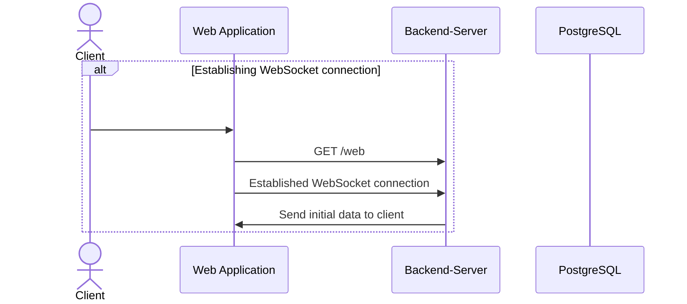
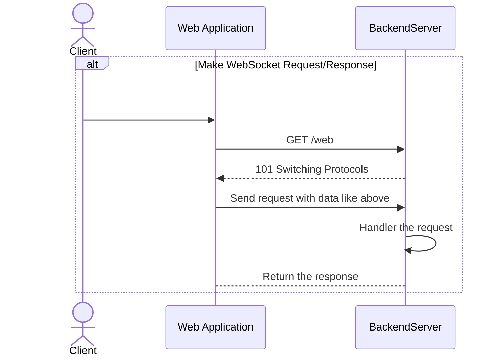
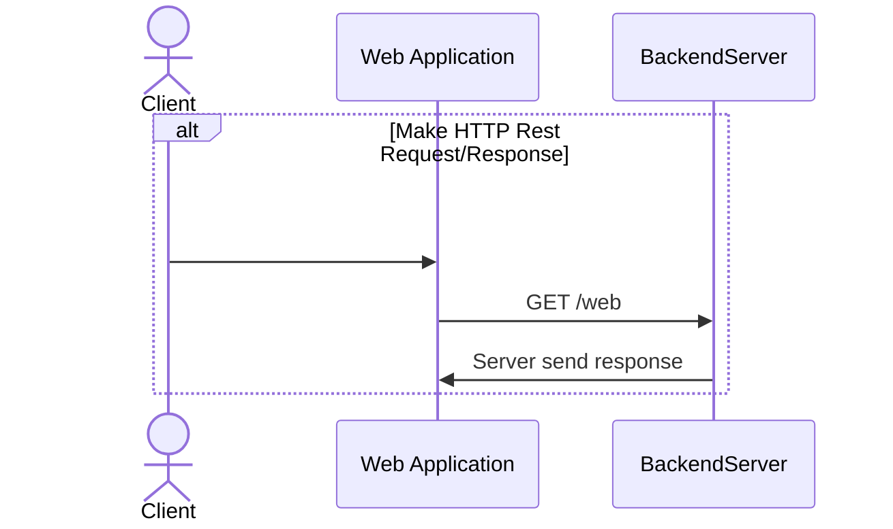

# API and WS handers documentation

## Establish WebSocket conenction



## Make WebSocket Request/Response

### Request data format
```json
{
    "pkg_id": "<int>",
    "req_id": "<uuid>",
    "data": {...}
}
```

### Response data format
```json
{
    "pkg_id": "<int>",
    "req_id": "Same <UUID> like request",
    "status": "OK"
    "data": {...}
}
```



## Make HTTP Request/Response


