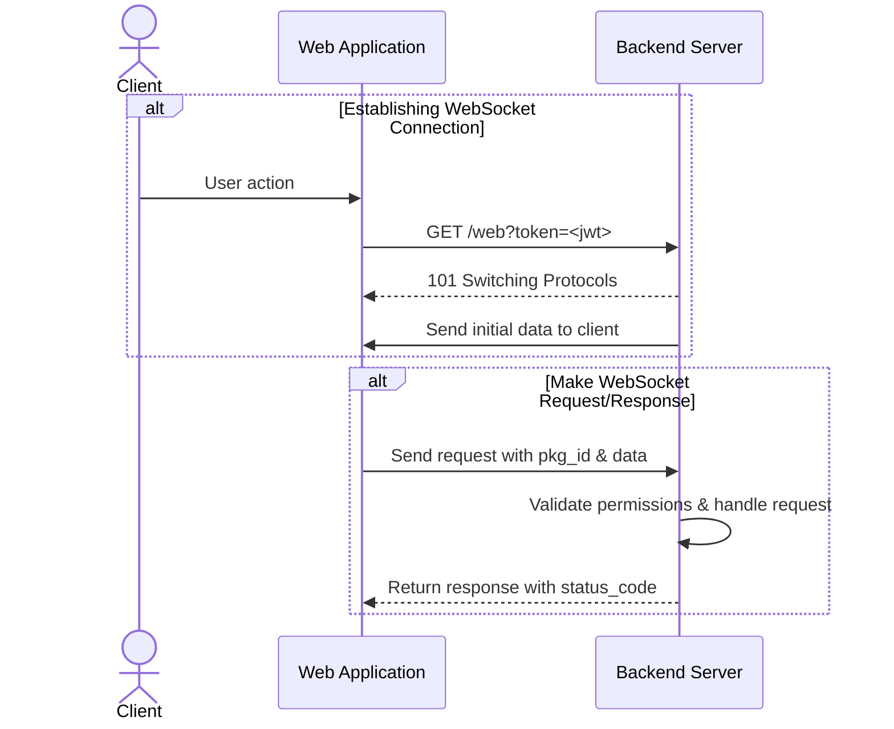

# 🚀 FastAPI HTTP & WebSocket Template

> 📢 **Hobby Project Notice:** This is a research and learning project exploring FastAPI best practices. Feel free to use it as a reference, report issues, or suggest improvements! Contributions and feedback are always welcome.

A comprehensive FastAPI template with **HTTP REST API** and **WebSocket** real-time communication, featuring role-based access control (RBAC), Keycloak authentication, PostgreSQL database, and comprehensive monitoring.

📚 **[View Full Documentation](https://acikabubo.github.io/fastapi-http-websocket/)** | 🚀 **[Quick Start Guide](https://acikabubo.github.io/fastapi-http-websocket/getting-started/quickstart/)** | 🎯 **[Development Guide](CLAUDE.md)**

## Table of Contents

- [Features](#features)
- [Prerequisites](#prerequisites)
- [Quick Start](#quick-start)
- [Installation](#installation)
- [Documentation](#documentation)
- [Configuration](#configuration)
- [Usage](#usage)
  - [HTTP API](#http-api)
  - [WebSocket API](#websocket-api)
- [Architecture Overview](#architecture-overview)
- [API Reference](#api-reference)
- [Development](#development)
- [Testing](#testing)
- [Troubleshooting](#troubleshooting)
- [Contributing](#contributing)
- [License](#license)

## ✨ Features

### 🎯 Core Features
- 🔌 **Dual Protocol Support**: HTTP REST API and WebSocket real-time communication
- 🔐 **Authentication**: Keycloak-based JWT token authentication with token caching
- 🛡️ **Authorization**: Fine-grained RBAC with decorator-based permissions
- ⏱️ **Rate Limiting**: Redis-based sliding window rate limiting for HTTP and WebSocket
- 📝 **Audit Logging**: Queue-based async audit logging with PostgreSQL storage
- 🗄️ **Database**: PostgreSQL with async SQLModel/SQLAlchemy and Alembic migrations
- 💾 **Caching**: Redis integration for session management, rate limiting, and token caching
- 📦 **Package Router**: Custom routing system for WebSocket request handling with JSON schema validation

### 🛠️ Developer Experience
- ✅ **Type Safety**: Strict type checking with mypy (--strict mode)
- 🎨 **Code Quality**: Pre-commit hooks with ruff, bandit, interrogate, typos, and security scanning
- 🧪 **Testing**: Comprehensive test suite with pytest, 81%+ coverage, load tests, and chaos tests
- 📖 **Documentation**: Auto-generated docs with MkDocs Material, published to GitHub Pages
- ⚡ **Code Generation**: Template-based WebSocket handler generator with AST validation

### 🚀 Production Features
- 📊 **Monitoring**: Prometheus metrics with Grafana dashboards (HTTP, WebSocket, DB, Redis, Keycloak, Circuit Breakers) — powered by [`fastapi-telemetry`](https://pypi.org/project/fastapi-telemetry/)
- 📋 **Logging**: Structured JSON logging with correlation IDs and Grafana Loki integration via Alloy — powered by [`fastapi-correlation`](https://pypi.org/project/fastapi-correlation/)
- 🔔 **Alerting**: Prometheus alerting rules for critical system events (errors, downtime, circuit breakers)
- 🔒 **Security**: Security headers middleware, request size limits, IP spoofing protection
- 🔄 **Resilience**: Circuit breaker pattern for Keycloak and Redis with fail-fast protection
- 🐳 **Containerization**: Docker Compose with health checks, Traefik reverse proxy, and BasicAuth
- ⚡ **Performance**: Connection pooling, pagination caching, slow query detection
- 📡 **Protocol Buffers**: Optional protobuf support for WebSocket (30-50% smaller messages)

## 📋 Prerequisites

- 🐍 **Python**: 3.13+ (specified in [pyproject.toml:6](pyproject.toml#L6))
- 📦 **uv**: Modern Python package manager ([installation guide](https://github.com/astral-sh/uv))
- 🐳 **Docker & Docker Compose**: For containerized services
- 🗄️ **PostgreSQL**: 14+ (provided via Docker)
- 💾 **Redis**: 7+ (provided via Docker)
- 🔐 **Keycloak**: Authentication server (provided via Docker)

## 🚀 Quick Start

```bash
# 1. Clone the repository
git clone https://github.com/acikabubo/fastapi-http-websocket.git
cd fastapi-http-websocket

# 2. Set up environment variables
cp docker/.srv_env.example docker/.srv_env
cp docker/.db_env.example docker/.db_env
cp docker/.kc_env.example docker/.kc_env
# Edit the .env files with your configuration

# 3. Start all services (PostgreSQL, Redis, Keycloak, Traefik, monitoring stack)
make start

# 4. Install dependencies and run database migrations
uv sync
make migrate

# 5. Start the development server with hot-reload
make serve
```

**🌐 Access Points:**
- 🚀 **Application**: `http://localhost:8000`
- 📚 **API Docs**: `http://localhost:8000/docs`
- 📊 **Grafana**: `http://localhost:3000` (admin/admin)
- 📈 **Prometheus**: `http://prometheus.localhost` (requires BasicAuth: admin/admin)
- 📋 **Loki**: `http://loki.localhost` (requires BasicAuth: admin/admin)
- 🔐 **Keycloak**: `http://localhost:8080` (admin/admin)

## 💻 Installation

### 🏠 Local Development Setup

```bash
# Install uv package manager (if not already installed)
curl -LsSf https://astral.sh/uv/install.sh | sh

# Install project dependencies
uv sync

# Install pre-commit hooks
uv run pre-commit install
```

### 🐳 Docker Setup

```bash
# Build all containers
make build

# Start services in detached mode
make start

# View logs
docker-compose logs -f

# Stop services
make stop

# Enter development shell
make shell
```

## ⚙️ Configuration

### 🔧 Environment Variables

The project uses separate environment files for different services:

**Application** (`docker/.srv_env`):
```bash
# Environment
ENV=dev  # dev, staging, production

# Database
DB_USER=postgres
DB_PASSWORD=postgres
DB_HOST=hw-db
DB_PORT=5432
DB_NAME=hw

# Redis
REDIS_IP=hw-redis
REDIS_PORT=6379
MAIN_REDIS_DB=1
AUTH_REDIS_DB=10

# Keycloak
KEYCLOAK_BASE_URL=http://hw-keycloak:8080
KEYCLOAK_REALM=hw
KEYCLOAK_CLIENT_ID=hw-client
KEYCLOAK_ADMIN_USERNAME=admin
KEYCLOAK_ADMIN_PASSWORD=admin

# Logging
LOG_LEVEL=INFO
LOG_CONSOLE_FORMAT=json  # json or human

# Rate Limiting
RATE_LIMIT_ENABLED=true
RATE_LIMIT_PER_MINUTE=60
RATE_LIMIT_FAIL_MODE=open  # open or closed

# Audit Logging
AUDIT_QUEUE_MAX_SIZE=10000
AUDIT_BATCH_SIZE=100
```

**Database** (`docker/.db_env`):
```bash
POSTGRES_USER=postgres
POSTGRES_PASSWORD=postgres
POSTGRES_DB=hw
```

**Keycloak** (`docker/.kc_env`):
```bash
KEYCLOAK_ADMIN=admin
KEYCLOAK_ADMIN_PASSWORD=admin
KC_DB=postgres
KC_DB_URL=jdbc:postgresql://hw-db:5432/keycloak
KC_DB_USERNAME=postgres
KC_DB_PASSWORD=postgres
KC_METRICS_ENABLED=true
```

See `.env.*.example` files for complete configuration options.

### 🛡️ RBAC Configuration

Role-based permissions are defined directly in code using decorators:

**WebSocket handlers** (`app/api/ws/handlers/`):
```python
@pkg_router.register(
    PkgID.GET_AUTHORS,
    json_schema=GetAuthorsModel,
    roles=["get-authors"]  # Required roles
)
async def get_authors_handler(request: RequestModel) -> ResponseModel:
    ...
```

**HTTP endpoints** (`app/api/http/`):
```python
from app.dependencies.permissions import require_roles

@router.get(
    "/authors",
    dependencies=[Depends(require_roles("get-authors"))]
)
async def get_authors():
    ...
```

No external configuration file needed - all permissions are co-located with handler code.

## 📖 Usage

### 🌐 HTTP API

#### 🔐 Authentication

All HTTP requests (except excluded paths) require Bearer token authentication:

```bash
# Login to get access token
curl -X POST http://localhost:8000/auth/login \
  -H "Content-Type: application/json" \
  -d '{"username": "user", "password": "password"}'

# Use token in subsequent requests
curl -X GET http://localhost:8000/api/authors \
  -H "Authorization: Bearer <your-token>"
```

#### 🎯 Available Endpoints

- `GET /health` - Health check endpoint
- `GET /api/authors` - Get authors list
- `POST /api/authors` - Create new author (requires admin role)

See [app/api/http/](app/api/http/) for all available HTTP endpoints.

### 🔌 WebSocket API

#### 🤝 Establishing Connection

```javascript
// Connect with authentication token (URL-encoded Bearer token in query params)
const token = 'your-jwt-token';
const ws = new WebSocket(
    `ws://localhost:8000/web?Authorization=${encodeURIComponent('Bearer ' + token)}`
);

ws.onopen = () => {
    console.log('Connected to WebSocket');
};

ws.onmessage = (event) => {
    const response = JSON.parse(event.data);
    console.log('Received:', response);
};

ws.onerror = (error) => {
    console.error('WebSocket error:', error);
};

ws.onclose = (event) => {
    console.log('WebSocket closed:', event.code, event.reason);
};
```

🔒 **Security Note:** WebSocket authentication uses query parameters due to browser WebSocket API limitations. Always use WSS (WebSocket over TLS) in production and implement token refresh for long-lived connections. See [CLAUDE.md](CLAUDE.md#websocket-authentication-security) for security best practices.

#### 📤 Request Format

```json
{
    "pkg_id": 1,
    "req_id": "550e8400-e29b-41d4-a716-446655440000",
    "data": {}
}
```

**Paginated Request:**
```json
{
    "pkg_id": 2,
    "req_id": "550e8400-e29b-41d4-a716-446655440000",
    "data": {
        "page": 1,
        "per_page": 20
    }
}
```

*Note: If pagination params are omitted, defaults are `page=1` and `per_page=20`*

#### 📥 Response Format

**Regular Response:**
```json
{
    "pkg_id": 1,
    "req_id": "550e8400-e29b-41d4-a716-446655440000",
    "status_code": 0,
    "data": {...}
}
```

**Paginated Response:**
```json
{
    "pkg_id": 2,
    "req_id": "550e8400-e29b-41d4-a716-446655440000",
    "status_code": 0,
    "meta": {
        "page": 1,
        "per_page": 20,
        "total": 45,
        "pages": 3
    },
    "data": [...]
}
```

#### 🔄 WebSocket Flow Diagram



## 🏗️ Architecture Overview

### 🔄 Request Flow

**HTTP Requests:**
1. Request hits FastAPI endpoint
2. `AuthenticationMiddleware` authenticates user via Keycloak token
3. `require_roles()` FastAPI dependency checks RBAC permissions (defined in decorator)
4. Request reaches endpoint handler in [app/api/http/](app/api/http/)

**WebSocket Requests:**
1. Client connects to `/web` with JWT token in query params
2. `PackageAuthWebSocketEndpoint` authenticates the connection
3. Client sends JSON with `pkg_id`, `req_id`, and `data`
4. `PackageRouter` validates permissions, validates data schema, and dispatches to handler
5. Handler returns `ResponseModel` sent back to client

### 🔧 Core Components

#### PackageRouter

Central routing system for WebSocket requests defined in [app/routing.py](app/routing.py):

```python
# Register a handler
@pkg_router.register(PkgID.GET_AUTHORS, json_schema=AuthorSchema)
async def get_authors_handler(request: RequestModel) -> ResponseModel:
    # Handler logic
    return ResponseModel.success(request.pkg_id, request.req_id, data=[...])
```

**Features:**
- Dynamic handler registration using decorators
- Optional JSON schema validation
- Built-in permission checking
- Type-safe request/response models

#### Authentication Backend

[app/auth.py](app/auth.py) - Keycloak JWT token validation powered by [`fastapi-keycloak-rbac`](https://github.com/acikabubo/fastapi-keycloak-rbac) ([PyPI](https://pypi.org/project/fastapi-keycloak-rbac/)):
- Decodes JWT tokens from Authorization header (HTTP) or query string (WebSocket)
- Extracts user data into `UserModel` with roles
- Configurable excluded paths via `EXCLUDED_PATHS` regex

#### RBAC Manager

[app/managers/rbac_manager.py](app/managers/rbac_manager.py) - Singleton permission manager backed by [`fastapi-keycloak-rbac`](https://github.com/acikabubo/fastapi-keycloak-rbac) ([PyPI](https://pypi.org/project/fastapi-keycloak-rbac/)):
- `check_ws_permission(pkg_id, user)` - Validates WebSocket permissions from `pkg_router.permissions_registry`
- `require_roles(*roles)` - FastAPI dependency for HTTP permission checking
- Permissions defined in code via decorators, not external config files

#### Keycloak Manager

[app/managers/keycloak_manager.py](app/managers/keycloak_manager.py) - Singleton Keycloak client wrapping [`fastapi-keycloak-rbac`](https://github.com/acikabubo/fastapi-keycloak-rbac) ([PyPI](https://pypi.org/project/fastapi-keycloak-rbac/)):
- Adds circuit breaker protection (pybreaker) and Prometheus metrics on top of the package
- `login_async(username, password)` - Returns access token
- `decode_token(token)` - Decodes and validates a JWT token
- Configured via environment variables

#### Observability Middleware

[app/middlewares/pipeline.py](app/middlewares/pipeline.py) — middleware stack powered by two in-house packages:

- [`fastapi-correlation`](https://github.com/acikabubo/fastapi-correlation) ([PyPI](https://pypi.org/project/fastapi-correlation/)) — `CorrelationIDMiddleware` (injects `X-Correlation-ID` per request), `LoggingContextMiddleware` (enriches every log record with `endpoint`, `method`, `status_code`, `user_id`), `StructuredJSONFormatter` / `HumanReadableFormatter`
- [`fastapi-telemetry`](https://github.com/acikabubo/fastapi-telemetry) ([PyPI](https://pypi.org/project/fastapi-telemetry/)) — `PrometheusMiddleware` (HTTP request duration/count/in-progress metrics via injectable callbacks), `CircuitBreakerMetricsListener` (exports pybreaker state to Prometheus), safe `get_or_create_*` metric helpers

#### WebSocket Connection Manager

[app/managers/websocket_connection_manager.py](app/managers/websocket_connection_manager.py):
- Manages active WebSocket connections
- `broadcast(message)` - Sends message to all connected clients
- Connection lifecycle tracking with logging

#### Database

[app/storage/db.py](app/storage/db.py) - PostgreSQL with async SQLModel:
- `get_paginated_results(model, page, per_page, filters=...)` - Pagination helper
- Custom filter functions via `apply_filters` parameter
- Automatic retry logic in `wait_and_init_db()`

### 📁 Directory Structure

```
app/
├── __init__.py                 # Application factory
├── api/
│   ├── http/                   # HTTP endpoint routers
│   │   ├── author.py
│   │   └── health.py
│   └── ws/
│       ├── consumers/          # WebSocket endpoint classes
│       ├── handlers/           # WebSocket request handlers
│       └── constants.py        # PkgID and RSPCode enums
├── managers/                   # Singleton managers
│   ├── rbac_manager.py
│   ├── keycloak_manager.py
│   └── websocket_connection_manager.py
├── middlewares/                # Custom middleware
├── models/                     # SQLModel database models
├── schemas/                    # Pydantic validation schemas
├── tasks/                      # Background tasks
└── storage/                    # Database and Redis utilities
```

## 📚 API Reference

### 📦 WebSocket Package IDs

Available `PkgID` values defined in [app/api/ws/constants.py](app/api/ws/constants.py):

| PkgID | Value | Handler | Description | Required Role |
|-------|-------|---------|-------------|---------------|
| `GET_AUTHORS` | 1 | `get_authors_handler` | Retrieve author list with optional filters (id, name, search_term) | `get-authors` |
| `GET_PAGINATED_AUTHORS` | 2 | `get_paginated_authors_handler` | Retrieve paginated authors with metadata (page, per_page, filters) | `get-authors` |
| `CREATE_AUTHOR` | 3 | `create_author_handler` | Create new author (requires name) | `create-author` |
| `UNREGISTERED_HANDLER` | 999 | _(none)_ | Test-only PkgID for testing unregistered handlers | _(test only)_ |

**Handler Location:** All WebSocket handlers are in [app/api/ws/handlers/author_handlers.py](app/api/ws/handlers/author_handlers.py) and registered using the `@pkg_router.register()` decorator.

### 📊 Response Status Codes

`RSPCode` enumeration in [app/api/ws/constants.py:4-30](app/api/ws/constants.py#L4-L30):

| Code | Value | Description |
|------|-------|-------------|
| `OK` | 0 | Operation completed successfully |
| `ERROR` | 1 | General error occurred |
| `INVALID_DATA` | 2 | Provided data is invalid or malformed |
| `PERMISSION_DENIED` | 3 | User lacks required permissions |

### ⚡ Creating New WebSocket Handlers

```bash
# Add new PkgID to app/api/ws/constants.py
# Then generate handler from template
make new-ws-handlers

# Or manually create in app/api/ws/handlers/
```

See [CLAUDE.md](CLAUDE.md#websocket-handler-management) for detailed instructions.

## 🛠️ Development

For comprehensive development workflows, commands, and best practices, see **[CLAUDE.md](CLAUDE.md)**.

### ⚡ Common Commands

```bash
# Start development server with hot-reload
make serve

# Run tests
uv run pytest

# Run single test
uv run pytest tests/test_check.py::test_function_name

# Code quality checks
make ruff-check          # Linting
uvx ruff format          # Formatting
uvx mypy app/            # Type checking
uvx interrogate app/     # Docstring coverage (≥80%)

# Security scanning
make bandit-scan         # SAST scanning
make skjold-scan         # Dependency vulnerabilities
make dead-code-scan      # Find unused code

# WebSocket handlers
make ws-handlers         # Show PkgID table
make new-ws-handlers     # Generate new handler
```

### 🎯 Pre-commit Hooks

All commits must pass:
- **ruff**: Linting and formatting (79 char line length)
- **mypy**: Strict type checking
- **interrogate**: ≥80% docstring coverage
- **typos**: Spell checking
- **bandit**: Security scanning (low severity threshold)
- **skjold**: Dependency vulnerability checks

### 📝 Code Style Requirements

- **Line length**: 79 characters
- **Type hints**: Required on all functions (mypy --strict)
- **Docstrings**: Required on all public functions, classes, and methods
- **Formatting**: Double quotes, 4-space indentation

## 🧪 Testing

```bash
# Run all tests in parallel (default, uses pytest-xdist)
make test
# Or: uv run pytest -n auto tests

# Run tests sequentially (for debugging)
make test-serial
# Or: uv run pytest tests

# Run specific test file
uv run pytest tests/test_routing.py -v

# Run with coverage report
make test-coverage
# Or: uv run pytest --cov=app --cov-report=html tests

# Run load tests (marked with @pytest.mark.load)
uv run pytest -m load tests/load/ -v -s

# Run chaos tests (failure scenarios, marked with @pytest.mark.chaos)
uv run pytest -m chaos tests/chaos/ -v -s

# Skip slow tests
uv run pytest -m "not load and not chaos"
```

**✅ Test Infrastructure:**
- **Parallel Execution**: Tests run in parallel by default (3-5x faster)
- **Centralized Fixtures**: Common test data in `tests/conftest.py`
- **Mock Factories**: Reusable mocks in `tests/mocks/` (auth, Redis, WebSocket, repositories)
- **Coverage**: 81%+ test coverage enforced by pre-commit hook
- **Load Testing**: WebSocket load tests (100-1000 concurrent connections)
- **Chaos Engineering**: Failure scenario tests (Redis down, DB failures, Keycloak unavailable)

See [docs_site/development/testing.md](https://acikabubo.github.io/fastapi-http-websocket/development/testing/) for comprehensive testing guide.

## 🔧 Troubleshooting

### ⚠️ Common Issues

#### 🚫 Connection Refused Errors

**Problem**: `Connection refused` when connecting to services

**Solution**:
```bash
# Verify services are running
docker-compose ps

# Restart services
make stop
make start

# Check logs for errors
docker-compose logs -f
```

#### 🐘 PostgreSQL Major Version Upgrade

**Problem**: Container exits immediately after upgrading PostgreSQL image (e.g. 13 → 18)

**Root cause**: PostgreSQL data format is incompatible across major versions. The old data volume cannot be read by the new engine.

**💡 Solution — dump & restore**:

```bash
# 1. Revert to old version temporarily
#    Edit docker/docker-compose.yml → set postgres image back to old version

# 2. Start the old container and dump ALL databases (app + Keycloak)
make start-server
docker exec hw-db pg_dump -U postgres hw       > hw_backup.sql
docker exec hw-db pg_dump -U postgres keycloak > keycloak_backup.sql

# 3. Stop containers and delete the old data volume
make stop
docker volume rm fastapi-http-websocket_postgres-hw-data

# 4. Update to new postgres version in docker/docker-compose.yml
#    Also update the volume mount path:
#      OLD: /var/lib/postgresql/data
#      NEW: /var/lib/postgresql   (required for PostgreSQL 15+)

# 5. Start fresh container and restore both databases
make start-server
cat hw_backup.sql       | docker exec -i hw-db psql -U postgres hw
cat keycloak_backup.sql | docker exec -i hw-db psql -U postgres keycloak

# 6. Run migrations to catch up any schema changes
make migrate
```

> **Note:** Dumping the `keycloak` database preserves all realms, users, roles, clients,
> and signing keys. Skipping this step will cause Keycloak to regenerate its RSA keys on
> first boot, invalidating all existing tokens (see [Keycloak Major Version Upgrade](#-keycloak-major-version-upgrade) below).

#### 🔐 Keycloak Major Version Upgrade

**Problem**: After upgrading Keycloak image, `JWTMissingKey` errors appear in the app

**Root cause**: Keycloak regenerates RSA signing keys on first startup with a new version (or after DB wipe). The app and Redis hold stale cached tokens/JWKS signed by the old keys.

**💡 Solution**:

```bash
# 1. Clear the Redis token cache (forces fresh JWKS fetch)
docker exec hw-redis redis-cli FLUSHDB

# 2. Restart the app server to reload keys
docker compose -f docker/docker-compose.yml restart hw-server

# 3. Clear browser storage to remove stale tokens
#    Chrome/Firefox: DevTools (F12) → Application → Local Storage → Clear All
#    Or simply open an Incognito/Private window

# 4. Log out of all clients (browser, Grafana, etc.) and log back in
#    Existing JWTs were signed with the old key and cannot be reused
```

#### 🔐 Keycloak Authentication Failures

**Problem**: `401 Unauthorized` or invalid token errors

**💡 Solutions**:
1. Verify Keycloak is running: `curl http://localhost:8080`
2. Check realm and client configuration in `.env`
3. Ensure token hasn't expired (tokens have limited lifetime)
4. Verify user has required roles in Keycloak admin console

#### 🗄️ Database Migration Issues

**Problem**: Database schema out of sync

**💡 Solutions**:
```bash
# Reset database (WARNING: destroys data)
docker-compose down -v
make start

# Or manually run migrations
uv run alembic upgrade head
```

#### 🔌 WebSocket Connection Drops

**Problem**: WebSocket connections disconnect unexpectedly

**💡 Solutions**:
1. Check token validity in query parameters
2. Verify user has required roles defined in handler's `@pkg_router.register(roles=[...])` decorator
3. Check server logs for permission denied errors
4. Ensure Redis is running for session management

#### 📦 Import Errors

**Problem**: `ModuleNotFoundError` when running the application

**💡 Solutions**:
```bash
# Reinstall dependencies
uv sync

# Clear Python cache
find . -type d -name "__pycache__" -exec rm -rf {} +
find . -type f -name "*.pyc" -delete
```

#### 🎯 Pre-commit Hook Failures

**Problem**: Commits blocked by pre-commit hooks

**💡 Solutions**:
```bash
# Run individual hooks to identify issues
uvx ruff check --config=pyproject.toml  # Linting
uvx mypy app/                            # Type checking
uvx interrogate app/                     # Docstrings

# Auto-fix formatting issues
uvx ruff format
```

### 💬 Getting Help

- Check application logs: `docker-compose logs -f`
- Enable debug logging: Set `LOG_LEVEL=DEBUG` in `.env`
- Review [CLAUDE.md](CLAUDE.md) for detailed development guidance
- Check Keycloak admin console: `http://localhost:8080/admin`

## 🤝 Contributing

### 🔄 Development Workflow

1. Create a feature branch from `main`
2. Make your changes following code style requirements
3. Ensure all pre-commit hooks pass
4. Write tests for new functionality
5. Update documentation if needed
6. Submit a pull request to `main` branch

### 📏 Code Standards

- All code must pass pre-commit hooks (ruff, mypy, interrogate, etc.)
- Minimum 80% docstring coverage required
- Type hints required on all functions
- Follow 79-character line length limit
- Write tests for new features and bug fixes

### 🔒 Security

- Never commit sensitive data (`.env` files, tokens, passwords)
- Run security scans before submitting PR: `make bandit-scan && make skjold-scan`
- Report security vulnerabilities privately to maintainers

## 📄 License

This project is licensed under the MIT License - see the LICENSE file for details.

## 🆕 Recent Updates

### 📅 January 2026
- ✅ **Test Coverage Improvement**: Increased from 80% to 81%+ with comprehensive tests for logging and routing modules
- ✅ **Documentation Reorganization**: Moved all documentation to `docs_site/` for better structure and GitHub Pages integration
- ✅ **BasicAuth for Observability**: Added authentication protection for Prometheus, Loki, and Grafana Alloy endpoints
- ✅ **Comprehensive Codebase Analysis**: Identified 22 improvement opportunities across security, performance, testing, and documentation

### 🎯 Open Issues & Roadmap

See our [GitHub Issues](https://github.com/acikabubo/fastapi-http-websocket/issues) for planned improvements:

**🔴 Critical Priority:**
- [#125](https://github.com/acikabubo/fastapi-http-websocket/issues/125) - WebSocket CSRF Protection
- [#126](https://github.com/acikabubo/fastapi-http-websocket/issues/126) - Audit Queue Overflow Backpressure

**🟠 High Priority:**
- [#127](https://github.com/acikabubo/fastapi-http-websocket/issues/127) - Replace Bare Exception Handling
- [#128](https://github.com/acikabubo/fastapi-http-websocket/issues/128) - Cursor-based Pagination
- [#129](https://github.com/acikabubo/fastapi-http-websocket/issues/129) - Edge Case Tests
- [#130](https://github.com/acikabubo/fastapi-http-websocket/issues/130) - Type-Safe Filter Validation
- [#131](https://github.com/acikabubo/fastapi-http-websocket/issues/131) - Pagination Cache Invalidation Guide

**🟡 Medium Priority:**
- [#132](https://github.com/acikabubo/fastapi-http-websocket/issues/132) - Explicit Return Types
- [#133](https://github.com/acikabubo/fastapi-http-websocket/issues/133) - Consolidate Repository Methods
- [#134](https://github.com/acikabubo/fastapi-http-websocket/issues/134) - Database Connection Pool Monitoring
- [#135](https://github.com/acikabubo/fastapi-http-websocket/issues/135) - WebSocket Protocol Documentation

**🔍 See all issues:** [GitHub Issues](https://github.com/acikabubo/fastapi-http-websocket/issues)

---

**⚡ Built with**: FastAPI · PostgreSQL · Redis · Keycloak · Prometheus · Grafana · Loki · Modern Python Tooling

## 📖 Documentation

### 📚 Complete Documentation

**Full documentation available at:** [https://acikabubo.github.io/fastapi-http-websocket/](https://acikabubo.github.io/fastapi-http-websocket/)

All documentation source files are in [`docs_site/`](docs_site/) and automatically published to GitHub Pages.

#### 🚀 Getting Started
- **[Installation](https://acikabubo.github.io/fastapi-http-websocket/getting-started/installation/)** - Environment setup and dependencies
- **[Quick Start](https://acikabubo.github.io/fastapi-http-websocket/getting-started/quickstart/)** - Get up and running in 5 minutes
- **[Configuration](https://acikabubo.github.io/fastapi-http-websocket/getting-started/configuration/)** - Environment variables and settings

#### 📖 User Guides
- **[Authentication](https://acikabubo.github.io/fastapi-http-websocket/guides/authentication/)** - Keycloak authentication and RBAC
- **[HTTP Endpoints](https://acikabubo.github.io/fastapi-http-websocket/guides/http-endpoints/)** - REST API usage
- **[WebSocket Handlers](https://acikabubo.github.io/fastapi-http-websocket/guides/websocket-handlers/)** - Real-time WebSocket communication
- **[Rate Limiting](https://acikabubo.github.io/fastapi-http-websocket/guides/rate-limiting/)** - Request throttling
- **[Audit Logging](https://acikabubo.github.io/fastapi-http-websocket/guides/audit-logging/)** - User action tracking
- **[Database Operations](https://acikabubo.github.io/fastapi-http-websocket/guides/database/)** - Repository pattern and pagination
- **[Monitoring](https://acikabubo.github.io/fastapi-http-websocket/guides/monitoring/)** - Prometheus, Grafana, Loki

#### 🏗️ Architecture
- **[Overview](https://acikabubo.github.io/fastapi-http-websocket/architecture/overview/)** - System architecture
- **[Design Patterns](https://acikabubo.github.io/fastapi-http-websocket/architecture/design-patterns/)** - Repository, Command, Dependency Injection
- **[Request Flow](https://acikabubo.github.io/fastapi-http-websocket/architecture/request-flow/)** - HTTP and WebSocket flow diagrams
- **[RBAC System](https://acikabubo.github.io/fastapi-http-websocket/architecture/rbac/)** - Role-based access control

#### 🛠️ Development
- **[Testing](https://acikabubo.github.io/fastapi-http-websocket/development/testing/)** - Test suite, load tests, chaos tests
- **[Database Migrations](https://acikabubo.github.io/fastapi-http-websocket/development/migrations/)** - Alembic migration workflow
- **[Code Quality](https://acikabubo.github.io/fastapi-http-websocket/development/code-quality/)** - Linting, formatting, type checking
- **[Protobuf Testing](https://acikabubo.github.io/fastapi-http-websocket/development/protobuf-testing/)** - Protocol Buffers usage
- **[Swagger UI Testing](https://acikabubo.github.io/fastapi-http-websocket/development/swagger-testing/)** - API documentation testing

#### 🚢 Deployment
- **[Docker Deployment](https://acikabubo.github.io/fastapi-http-websocket/deployment/docker/)** - Container orchestration
- **[Production Setup](https://acikabubo.github.io/fastapi-http-websocket/deployment/production/)** - Production configuration
- **[Security Guide](https://acikabubo.github.io/fastapi-http-websocket/deployment/security/)** - Security best practices
- **[BasicAuth for Observability](https://acikabubo.github.io/fastapi-http-websocket/deployment/basicauth/)** - Protecting metrics endpoints
- **[Monitoring & Observability](https://acikabubo.github.io/fastapi-http-websocket/deployment/monitoring/)** - Production monitoring stack
- **[Troubleshooting](https://acikabubo.github.io/fastapi-http-websocket/deployment/troubleshooting/)** - Common issues and solutions

#### 👥 For Contributors
- **[CLAUDE.md](CLAUDE.md)** - AI assistant development guidelines and project structure

### 🎯 Quick Links

- **Need authentication?** → [Quick Start Guide](https://acikabubo.github.io/fastapi-http-websocket/getting-started/quickstart/)
- **Building WebSocket handlers?** → [WebSocket Guide](https://acikabubo.github.io/fastapi-http-websocket/guides/websocket-handlers/)
- **Understanding architecture?** → [Design Patterns](https://acikabubo.github.io/fastapi-http-websocket/architecture/design-patterns/)
- **Want to contribute?** → [CLAUDE.md](CLAUDE.md)
