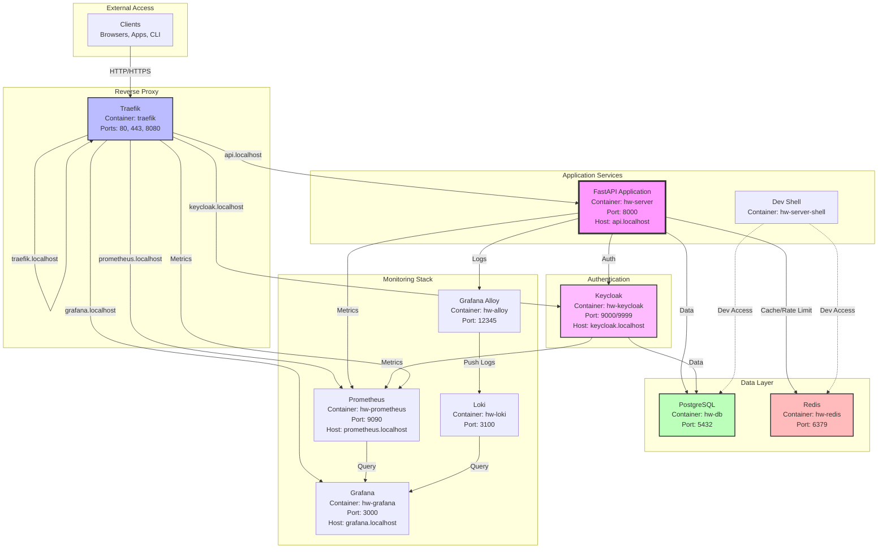
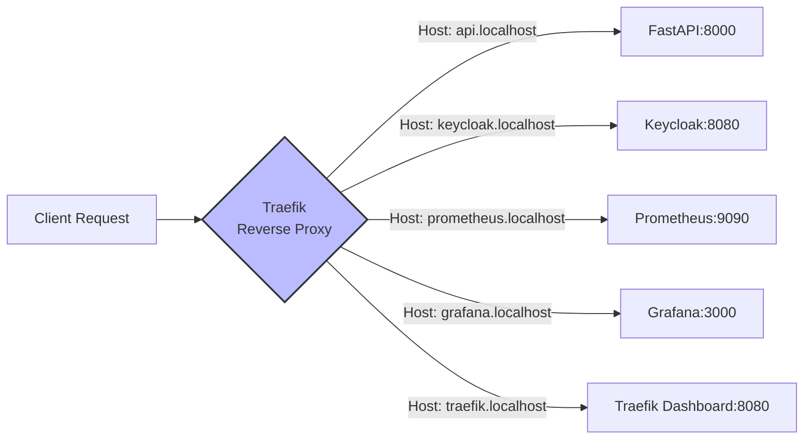
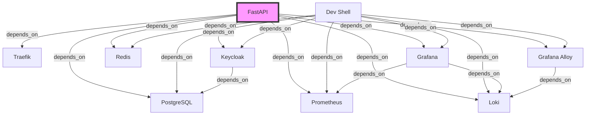

# Docker Services Architecture

**Last Updated**: 2025-12-28

This document provides a comprehensive overview of the Docker services that compose the application stack, including their connections, port mappings, and Traefik routing configuration.

## Service Topology



## Network Configuration

All services are connected via a single Docker bridge network: **`hw-network`**

This allows services to communicate using container names as hostnames (e.g., `hw-server:8000`, `hw-db:5432`).

## Port Mappings

### External Ports (Host → Container)

| Service | Host Port | Container Port | Protocol | Description |
|---------|-----------|----------------|----------|-------------|
| Traefik | 80 | 80 | HTTP | HTTP traffic |
| Traefik | 443 | 443 | HTTPS | HTTPS traffic (TLS) |
| Traefik | 8080 | 8080 | HTTP | Traefik dashboard |
| PostgreSQL | 5432 | 5432 | TCP | Database (dev access) |
| Redis | 6379 | 6379 | TCP | Cache (dev access) |
| Keycloak | 9999 | 9000 | HTTP | Keycloak metrics |
| Prometheus | 9090 | 9090 | HTTP | Prometheus UI |
| Grafana | 3000 | 3000 | HTTP | Grafana dashboards |

### Internal Ports (Container-to-Container)

| Service | Internal Port | Used By | Purpose |
|---------|---------------|---------|---------|
| FastAPI | 8000 | Traefik | Application API |
| Keycloak | 8080 | Traefik | Keycloak console |
| Loki | 3100 | Alloy, Grafana | Log aggregation |
| Alloy | 12345 | Browser (optional) | Alloy UI |

## Traefik Routing Configuration

### HTTP Routers



### Traefik Labels Configuration

#### FastAPI Service

```yaml
traefik.enable: "true"

# Main HTTP router
traefik.http.routers.fastapi.rule: "Host(`api.localhost`)"
traefik.http.routers.fastapi.entrypoints: "web"
traefik.http.routers.fastapi.service: "fastapi"
traefik.http.routers.fastapi.middlewares: "secure-headers@file,gzip-compress@file"

# Service definition
traefik.http.services.fastapi.loadbalancer.server.port: "8000"
traefik.http.services.fastapi.loadbalancer.healthcheck.path: "/health"
traefik.http.services.fastapi.loadbalancer.healthcheck.interval: "30s"

# WebSocket router (separate for /web endpoint)
traefik.http.routers.fastapi-ws.rule: "Host(`api.localhost`) && PathPrefix(`/web`)"
traefik.http.routers.fastapi-ws.entrypoints: "web"
traefik.http.routers.fastapi-ws.service: "fastapi"
```

#### Keycloak Service

```yaml
traefik.enable: "true"

traefik.http.routers.keycloak.rule: "Host(`keycloak.localhost`)"
traefik.http.routers.keycloak.entrypoints: "web"
traefik.http.routers.keycloak.service: "keycloak"

traefik.http.services.keycloak.loadbalancer.server.port: "8080"
```

#### Prometheus Service

```yaml
traefik.enable: "true"

traefik.http.routers.prometheus.rule: "Host(`prometheus.localhost`)"
traefik.http.routers.prometheus.entrypoints: "web"
traefik.http.routers.prometheus.service: "prometheus"
traefik.http.routers.prometheus.middlewares: "secure-headers@file"

traefik.http.services.prometheus.loadbalancer.server.port: "9090"
```

#### Grafana Service

```yaml
traefik.enable: "true"

traefik.http.routers.grafana.rule: "Host(`grafana.localhost`)"
traefik.http.routers.grafana.entrypoints: "web"
traefik.http.routers.grafana.service: "grafana"

traefik.http.services.grafana.loadbalancer.server.port: "3000"
```

### Traefik Middleware

Defined in `docker/traefik/dynamic/middleware.yml`:

**secure-headers** - Adds security headers:
- `X-Frame-Options: DENY`
- `X-Content-Type-Options: nosniff`
- `Strict-Transport-Security`
- `Referrer-Policy`

**gzip-compress** - Enables gzip compression for responses

## Service Details

### 1. Traefik (Reverse Proxy)

**Container**: `traefik`
**Image**: `traefik:v2.10`
**Networks**: `hw-network`
**Configuration**: `docker/traefik/traefik.yml`, `docker/traefik/dynamic/`

**Purpose**:
- HTTP/HTTPS reverse proxy
- Load balancing
- SSL/TLS termination
- Service discovery (Docker provider)
- WebSocket connection upgrade
- Metrics export for Prometheus

**Key Features**:
- Automatic service discovery via Docker labels
- Health checks for backend services
- Access logs in JSON format
- Prometheus metrics endpoint

### 2. FastAPI Application

**Container**: `hw-server`
**Image**: Custom (built from `Dockerfile`)
**Networks**: `hw-network`
**Depends On**: `hw-db`, `hw-redis`, `hw-keycloak`, `prometheus`, `grafana`, `loki`, `alloy`, `traefik`

**Environment**: Configured via `docker/.srv_env`

**Purpose**:
- Main application server
- HTTP REST API
- WebSocket real-time communication
- Business logic processing

**Exposed Services**:
- `/api/*` - HTTP REST endpoints
- `/web` - WebSocket endpoint
- `/metrics` - Prometheus metrics
- `/health` - Health check endpoint

### 3. Development Shell

**Container**: `hw-server-shell`
**Image**: Same as FastAPI
**Networks**: `hw-network`

**Purpose**:
- Interactive development shell
- Database migrations
- Management commands
- Testing and debugging

**Command**: `/bin/bash` (keeps container running)

### 4. Keycloak (Authentication)

**Container**: `hw-keycloak`
**Image**: `keycloak/keycloak:25.0`
**Networks**: `hw-network`
**Depends On**: `hw-db`

**Environment**: Configured via `docker/.kc_env`

**Purpose**:
- Identity and Access Management (IAM)
- JWT token issuance and validation
- User management
- OAuth 2.0 / OpenID Connect

**Key Features**:
- PostgreSQL backend
- Metrics enabled (`KC_METRICS_ENABLED=true`)
- Health checks enabled
- Realm import on startup

### 5. PostgreSQL Database

**Container**: `hw-db`
**Image**: `postgres:13`
**Networks**: `hw-network`
**Volumes**: `postgres-data:/var/lib/postgresql/data`

**Environment**:
- `POSTGRES_USER=postgres`
- `POSTGRES_PASSWORD=postgres`
- `POSTGRES_DB=hw_db`

**Purpose**:
- Primary data store
- Stores application data (authors, etc.)
- Stores audit logs (user_actions table)
- Keycloak backend database

**Health Check**: `pg_isready` command every 10 seconds

### 6. Redis Cache

**Container**: `hw-redis`
**Image**: `redis:alpine`
**Networks**: `hw-network`
**Volumes**: `redis-data:/data`

**Purpose**:
- High-performance caching
- Rate limiting counters (sliding window)
- WebSocket connection tracking
- User session storage
- Pagination count caching

**Health Check**: `redis-cli ping` every 10 seconds

**Redis Databases**:
- DB 0: Main cache (rate limiting, general caching)
- DB 1: Authentication cache (user sessions, tokens)

### 7. Prometheus (Metrics)

**Container**: `hw-prometheus`
**Image**: `prom/prometheus:latest`
**Networks**: `hw-network`
**Volumes**:
- `./prometheus/prometheus.yml:/etc/prometheus/prometheus.yml:ro`
- `./prometheus/alerts.yml:/etc/prometheus/alerts.yml:ro`
- `prometheus-data:/prometheus`

**Purpose**:
- Time-series metrics collection
- Alert rule evaluation
- Metrics storage and querying

**Scrape Targets**:
- FastAPI (`hw-server:8000/metrics`) - Every 60 seconds
- Keycloak (`hw-keycloak:9000/metrics`) - Every 30 seconds
- Traefik (`traefik:8080/metrics`) - Every 30 seconds

**Alert Rules**: 16 alerts across 8 categories (loaded from `alerts.yml`)

### 8. Grafana (Visualization)

**Container**: `hw-grafana`
**Image**: `grafana/grafana:latest`
**Networks**: `hw-network`
**Volumes**:
- `./grafana/provisioning:/etc/grafana/provisioning`
- `grafana-data:/var/lib/grafana`

**Purpose**:
- Metrics visualization
- Dashboard management
- Log querying (Loki)
- Alerting and notifications

**Data Sources** (auto-provisioned):
- Prometheus
- Loki
- PostgreSQL (for audit logs)

**Dashboards** (auto-provisioned):
- FastAPI Metrics
- Keycloak Metrics
- Application Logs
- Audit Logs

### 9. Loki (Log Aggregation)

**Container**: `hw-loki`
**Image**: `grafana/loki:latest`
**Networks**: `hw-network`
**Volumes**:
- `./loki/loki-config.yml:/etc/loki/local-config.yaml`
- `loki-data:/loki`

**Purpose**:
- Centralized log storage
- Log indexing and querying
- LogQL query language
- Integration with Grafana

### 10. Grafana Alloy (Log Collector)

**Container**: `hw-alloy`
**Image**: `grafana/alloy:latest`
**Networks**: `hw-network`
**Volumes**:
- `./alloy/config.alloy:/etc/alloy/config.alloy`
- `/var/run/docker.sock:/var/run/docker.sock:ro`

**Purpose**:
- Modern observability collector (replaces Promtail)
- Collects logs from application containers
- Sends logs to Loki
- Processes and enriches log data

**UI**: Available at http://localhost:12345 for debugging

## Service Dependencies



## Health Checks

| Service | Health Check Command | Interval | Timeout | Retries |
|---------|---------------------|----------|---------|---------|
| Traefik | `traefik healthcheck --ping` | 10s | 5s | 3 |
| PostgreSQL | `pg_isready` | 10s | 5s | 5 |
| Redis | `redis-cli ping` | 10s | 5s | 5 |

## Volume Mounts

**Persistent Volumes**:
- `postgres-data` - PostgreSQL database files
- `redis-data` - Redis persistence
- `prometheus-data` - Prometheus time-series data
- `grafana-data` - Grafana dashboards and settings
- `loki-data` - Loki log storage

**Configuration Volumes** (read-only):
- `./prometheus/prometheus.yml` → `/etc/prometheus/prometheus.yml`
- `./prometheus/alerts.yml` → `/etc/prometheus/alerts.yml`
- `./grafana/provisioning` → `/etc/grafana/provisioning`
- `./loki/loki-config.yml` → `/etc/loki/local-config.yaml`
- `./alloy/config.alloy` → `/etc/alloy/config.alloy`
- `./traefik/traefik.yml` → `/etc/traefik/traefik.yml`
- `./traefik/dynamic` → `/etc/traefik/dynamic`

## Service URLs

| Service | URL | Description |
|---------|-----|-------------|
| FastAPI API | http://api.localhost | Main API endpoints |
| FastAPI WebSocket | ws://api.localhost/web | WebSocket endpoint |
| FastAPI Metrics | http://api.localhost/metrics | Prometheus metrics |
| Keycloak Console | http://keycloak.localhost | Keycloak admin console |
| Prometheus | http://prometheus.localhost | Prometheus UI |
| Grafana | http://grafana.localhost | Grafana dashboards |
| Traefik Dashboard | http://traefik.localhost | Traefik routing info |
| Alloy UI | http://localhost:12345 | Alloy debugging UI |

## Starting Services

```bash
# Start all services
docker-compose -f docker/docker-compose.yml up -d

# Start specific service
docker-compose -f docker/docker-compose.yml up -d hw-server

# View logs
docker-compose -f docker/docker-compose.yml logs -f hw-server

# Stop all services
docker-compose -f docker/docker-compose.yml down

# Stop and remove volumes
docker-compose -f docker/docker-compose.yml down -v
```

## Scaling Considerations

**Horizontal Scaling Ready**:
- ✅ FastAPI (stateless, can run multiple instances behind Traefik)
- ✅ Traefik (supports multiple backend instances)

**Single Instance**:
- ⚠️ PostgreSQL (requires replication for HA)
- ⚠️ Redis (requires Redis Sentinel or Cluster for HA)
- ⚠️ Keycloak (can be clustered with shared database)

**Auto-scaling Targets** (Kubernetes):
- FastAPI pods based on CPU/memory
- Horizontal Pod Autoscaler (HPA) recommended

## Security Notes

**Production Hardening**:

1. **Change default credentials** in environment files
2. **Enable TLS/HTTPS** via Traefik Let's Encrypt
3. **Restrict network access** (remove exposed ports for DB/Redis)
4. **Use secrets management** (Docker secrets, Vault)
5. **Enable Traefik authentication** for dashboard
6. **Restrict Prometheus/Grafana access** (add authentication)
7. **Set `exposedByDefault: false`** in Traefik (already configured)

## Related Documentation

- [System Architecture Overview](overview.md)
- [Request Flow Documentation](request-flow.md)
- [Production Deployment Guide](../deployment/production.md)
- [Docker Deployment Guide](../deployment/docker.md)
- [Monitoring & Observability](../deployment/monitoring.md)
