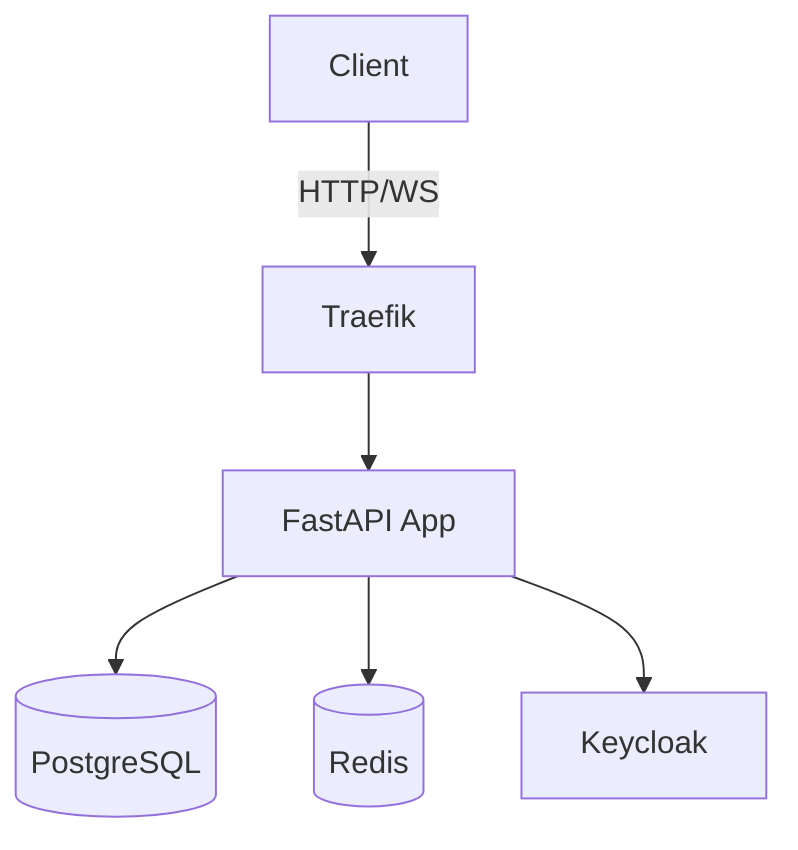

# Architecture

Learn about the system architecture, design patterns, and technical decisions.

## Contents

- [Overview](overview.md) - System architecture and component interactions
- [Design Patterns](design-patterns.md) - Repository, Command, and Dependency Injection patterns
- [Request Flow](request-flow.md) - HTTP and WebSocket request processing
- [RBAC System](rbac.md) - Role-based access control implementation

## Architecture Diagram

See [Overview](overview.md) for detailed architecture documentation.
