# Sequence Diagrams

This document provides detailed sequence diagrams for key flows in the application.

## Authentication Flow

### HTTP Login Flow

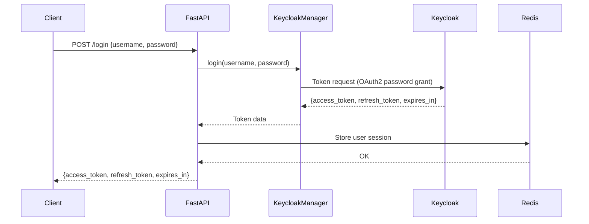

### WebSocket Authentication Flow

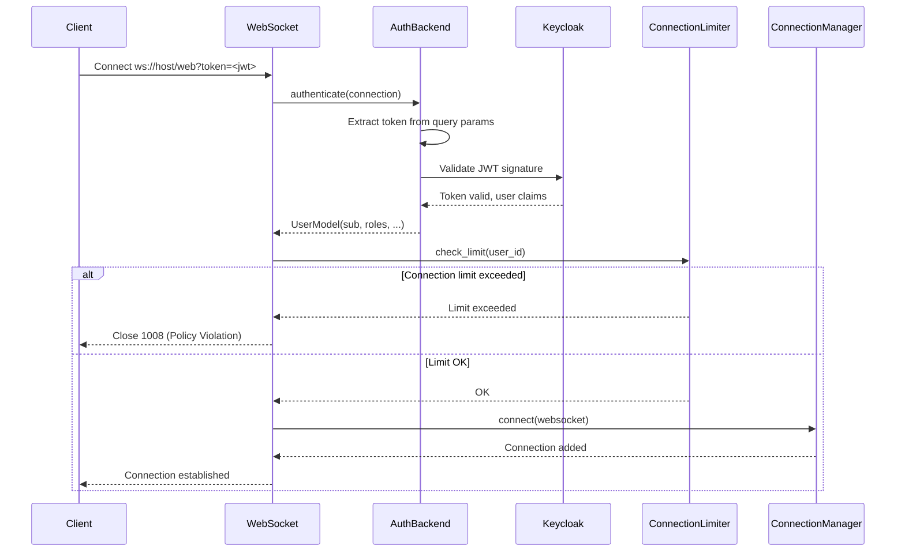

## HTTP Request Flow

### GET /authors with Filtering

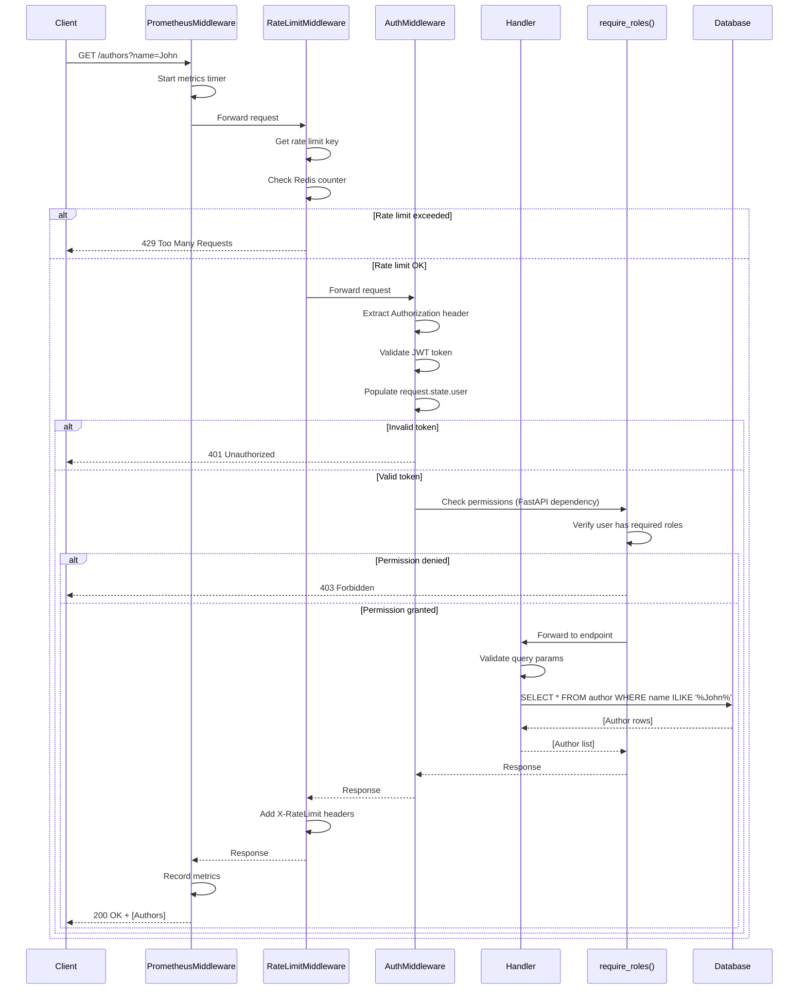

### POST /authors (Create)

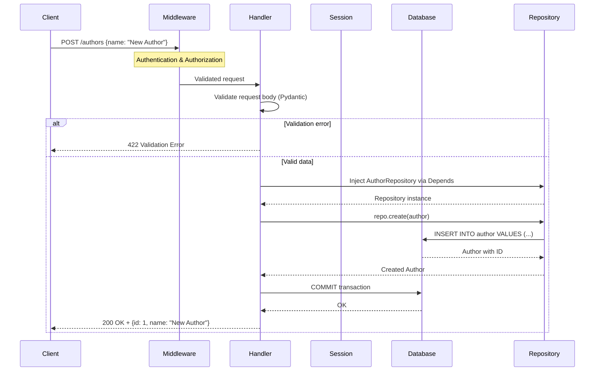

## WebSocket Request Flow

### GET_AUTHORS Request (PkgID: 1)

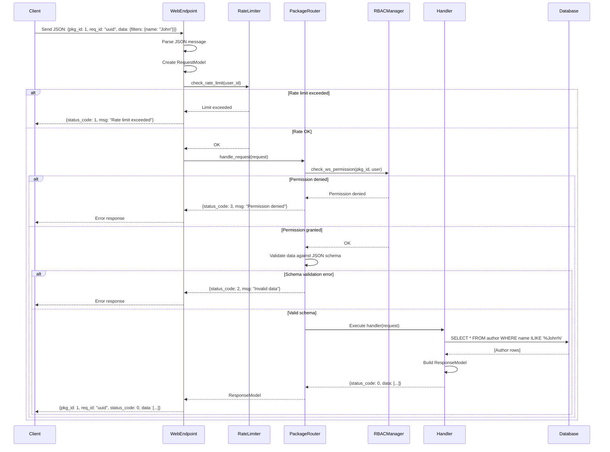

### GET_PAGINATED_AUTHORS Request (PkgID: 2)

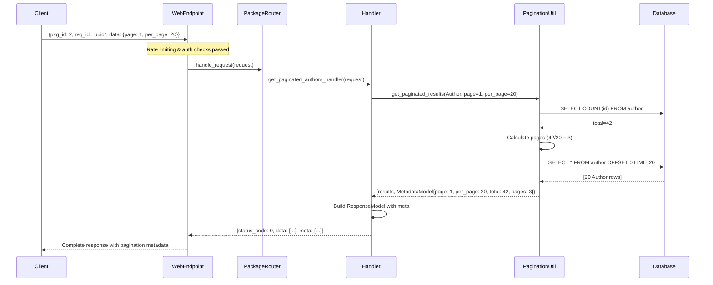

## Broadcast Flow

### Server-Initiated Broadcast

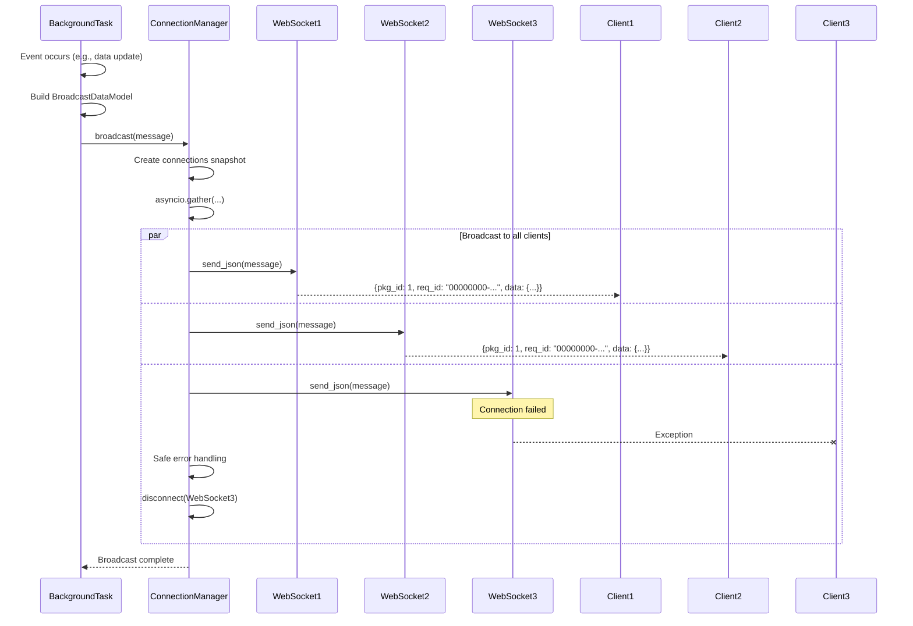

## Rate Limiting Flow

### Sliding Window Rate Limiting

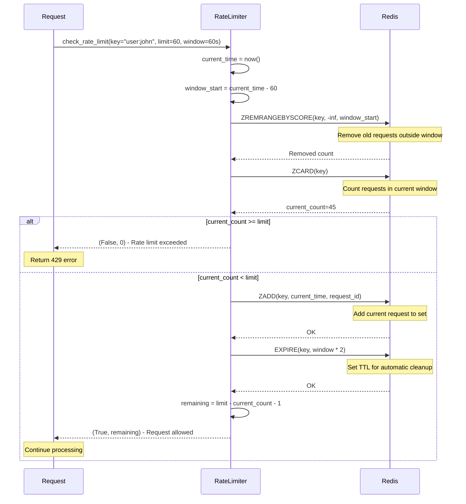

### WebSocket Connection Limiting

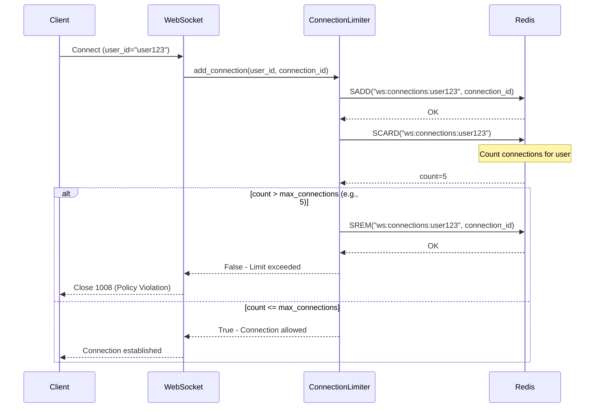

## Error Handling Flow

### Handler Error Recovery

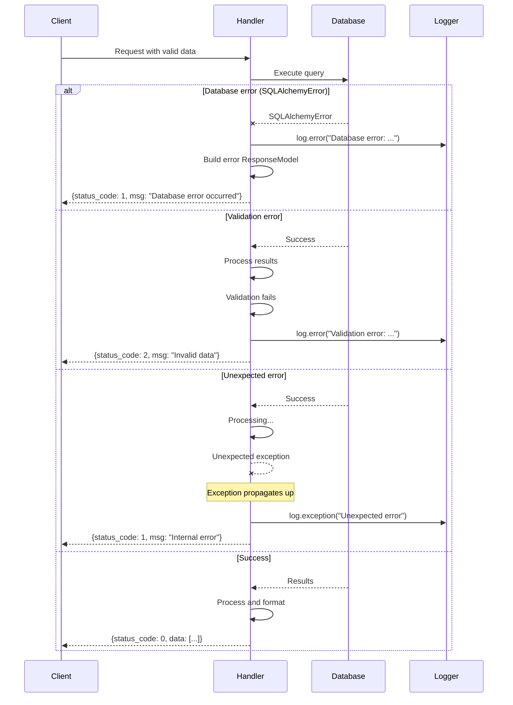

## Health Check Flow

### Health Check with Dependency Verification

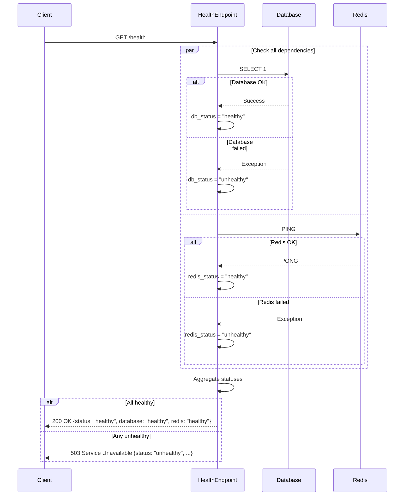

## Metrics Collection Flow

### Prometheus Metrics Scraping

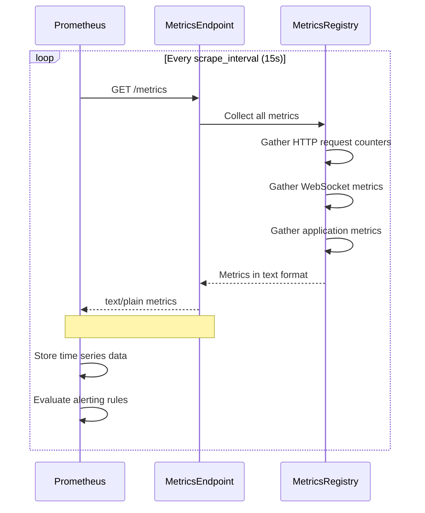

## Notes

These diagrams use Mermaid syntax and can be rendered using:
- GitHub (automatic rendering)
- Mermaid Live Editor: https://mermaid.live/
- VS Code with Mermaid extension
- Documentation tools that support Mermaid

For complex flows, refer to the source code in:
- `app/middlewares/` - Middleware implementations
- `app/routing.py` - WebSocket routing logic
- `app/api/ws/handlers/` - WebSocket handlers
- `app/api/http/` - HTTP handlers
