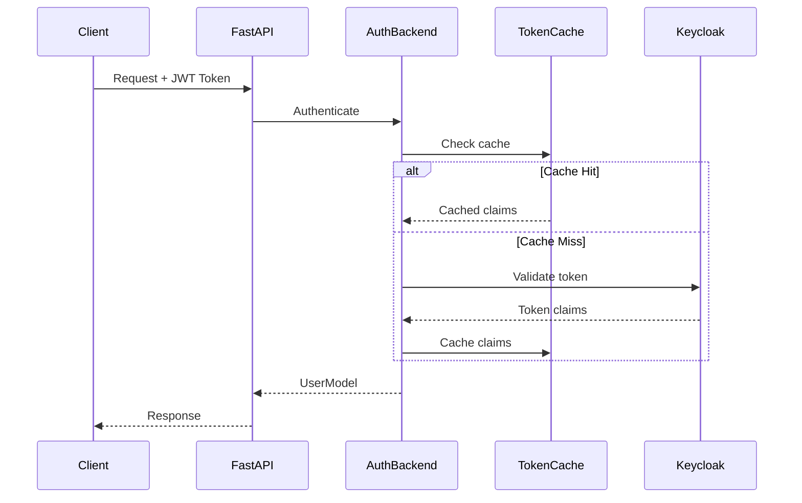
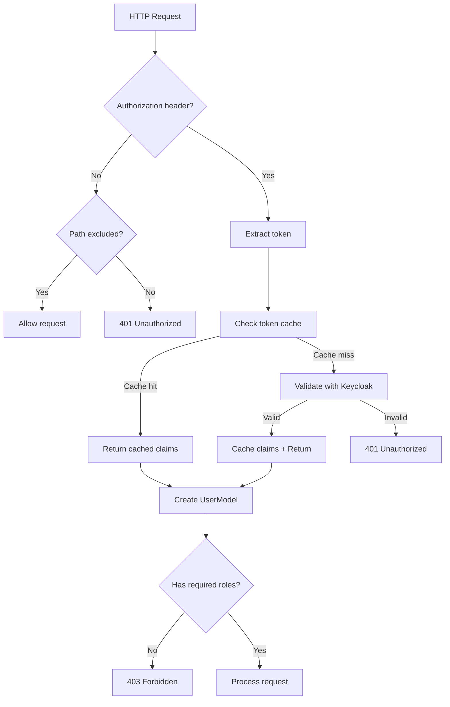
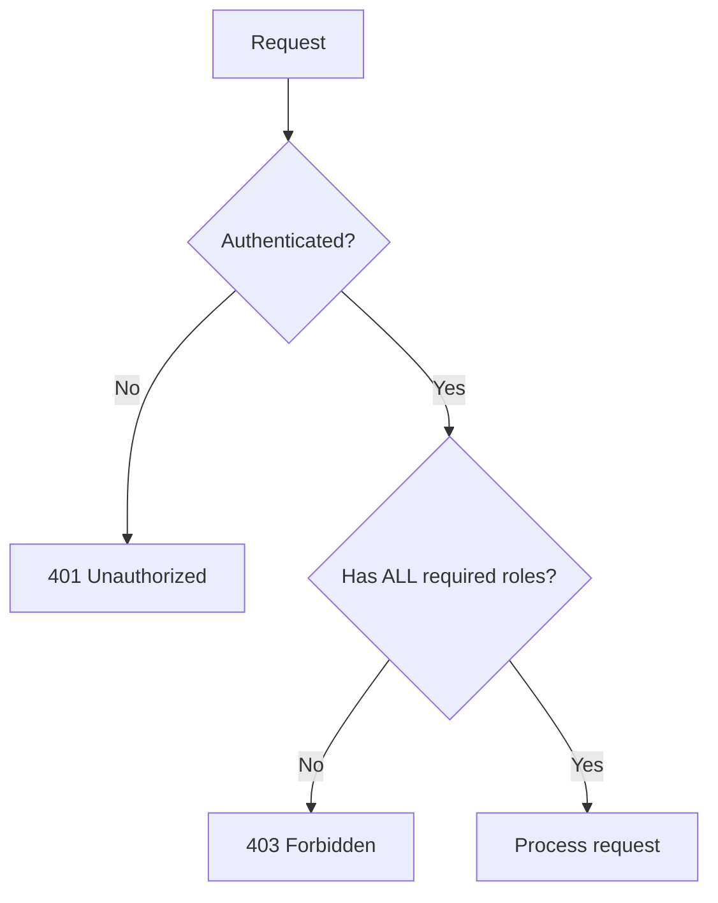
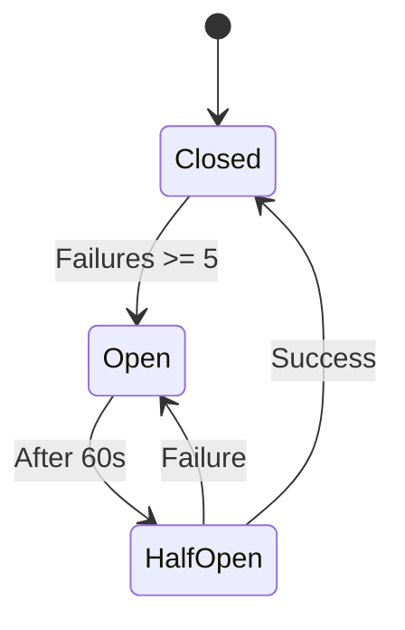

# Authentication Guide

Complete guide to authentication including HTTP and WebSocket flows, RBAC, token caching, circuit breakers, and security best practices.

## Table of Contents

1. [Overview](#overview)
2. [Quick Start](#quick-start)
3. [Configuration](#configuration)
4. [HTTP Authentication](#http-authentication)
5. [WebSocket Authentication](#websocket-authentication)
6. [Role-Based Access Control (RBAC)](#role-based-access-control-rbac)
7. [Token Caching](#token-caching)
8. [Debug Mode](#debug-mode)
9. [Prometheus Metrics](#prometheus-metrics)
10. [Circuit Breaker](#circuit-breaker)
11. [Security Best Practices](#security-best-practices)
12. [Troubleshooting](#troubleshooting)
13. [API Reference](#api-reference)

---

## Overview

The application uses **Keycloak** for authentication with JWT tokens. Authentication is handled by the `AuthBackend` class which integrates with FastAPI's authentication middleware.

### Architecture



### Key Components

- **AuthBackend** (`app/auth.py`): Validates JWT tokens from Authorization header or query parameters
- **KeycloakManager** (`app/managers/keycloak_manager.py`): Singleton managing Keycloak client instances
- **RBACManager** (`app/managers/rbac_manager.py`): Role-based access control enforcement
- **Token Cache** (`app/utils/token_cache.py`): Redis-based caching of decoded JWT claims
- **UserModel** (`app/schemas/user.py`): User data extracted from JWT claims

### Supported Auth Flows

1. **HTTP Authentication**: JWT token in `Authorization: Bearer <token>` header
2. **WebSocket Authentication**: JWT token in query parameter `?Authorization=Bearer%20<token>`

---

## Quick Start

### 1. Get a Token from Keycloak

```bash
# Using curl
TOKEN=$(curl -X POST "http://localhost:8080/realms/myrealm/protocol/openid-connect/token" \
  -d "client_id=myclient" \
  -d "client_secret=your-client-secret" \
  -d "username=testuser" \
  -d "password=password" \
  -d "grant_type=password" | jq -r '.access_token')
```

### 2. Test HTTP Endpoint

```bash
curl -H "Authorization: Bearer $TOKEN" http://localhost:8000/api/authors
```

### 3. Test WebSocket Connection

```javascript
const token = 'Bearer eyJhbGc...';
const wsUrl = `ws://localhost:8000/web?Authorization=${encodeURIComponent(token)}`;
const ws = new WebSocket(wsUrl);

ws.onopen = () => console.log('Authenticated!');
```

---

## Configuration

### Environment Variables

| Variable | Description | Required | Default |
|----------|-------------|----------|---------|
| `KEYCLOAK_BASE_URL` | Keycloak server URL | Yes | - |
| `KEYCLOAK_REALM` | Keycloak realm name | Yes | - |
| `KEYCLOAK_CLIENT_ID` | OAuth client ID | Yes | - |
| `KEYCLOAK_CLIENT_SECRET` | OAuth client secret | Yes | - |
| `KEYCLOAK_ADMIN_USERNAME` | Keycloak admin username | Yes | - |
| `KEYCLOAK_ADMIN_PASSWORD` | Keycloak admin password | Yes | - |
| `CIRCUIT_BREAKER_ENABLED` | Enable circuit breaker for Keycloak | No | `true` |
| `KEYCLOAK_CIRCUIT_BREAKER_FAIL_MAX` | Open circuit after N failures | No | `5` |
| `KEYCLOAK_CIRCUIT_BREAKER_TIMEOUT` | Circuit open duration (seconds) | No | `60` |

### Example .env File

```bash
# Production
KEYCLOAK_BASE_URL=https://keycloak.example.com
KEYCLOAK_REALM=production
KEYCLOAK_CLIENT_ID=prod-client
KEYCLOAK_CLIENT_SECRET=<strong-secret>
```

---

## HTTP Authentication

### Token Validation Flow



### Protected Endpoints

```python
from fastapi import APIRouter, Depends
from app.dependencies.permissions import require_roles

router = APIRouter()

# Any authenticated user
@router.get("/authenticated")
async def authenticated_endpoint(request: Request):
    user: UserModel = request.user
    return {"username": user.username}

# Specific roles required (user must have ALL)
@router.get("/admin", dependencies=[Depends(require_roles("admin"))])
async def admin_endpoint():
    return {"message": "Admin access"}
```

### Excluded Paths

Configured via `EXCLUDED_PATHS` regex in `app/settings.py`:

```python
EXCLUDED_PATHS: list[str] = [
    r"^/docs.*",      # API documentation
    r"^/metrics$",    # Prometheus metrics
    r"^/health$",     # Health check
]
```

---

## WebSocket Authentication

### Token in Query Parameters

⚠️ **IMPORTANT**: WebSocket connections use tokens in query parameters due to browser limitations (cannot send custom headers during handshake).

```javascript
// ❌ Not supported by WebSocket API
const ws = new WebSocket('wss://api.example.com/web', {
  headers: { 'Authorization': 'Bearer token' }
});

// ✅ Must use query parameters
const token = await getAccessToken();
const wsUrl = `wss://api.example.com/web?Authorization=${encodeURIComponent(token)}`;
const ws = new WebSocket(wsUrl);
```

### Security Implications

**Risks**:
- Tokens appear in server access logs
- Tokens stored in browser history
- Potential proxy caching

**Mitigations** (already implemented):
- ✅ Always use WSS (WebSocket over TLS)
- ✅ Short-lived tokens (5 minutes default)
- ✅ Origin validation for CSRF protection
- ✅ Referrer-Policy header prevents leakage

### Client Best Practices

```javascript
// 1. Get fresh token before connecting
const token = await getAccessToken();

// 2. Encode properly
const wsUrl = `wss://api.example.com/web?Authorization=${encodeURIComponent('Bearer ' + token)}`;

// 3. Connect
const ws = new WebSocket(wsUrl);

// 4. Refresh for long connections
setInterval(async () => {
    ws.close();
    const newToken = await refreshAccessToken();
    ws = new WebSocket(`wss://api.example.com/web?Authorization=${encodeURIComponent('Bearer ' + newToken)}`);
}, 4 * 60 * 1000); // Every 4 minutes
```

---

## Role-Based Access Control (RBAC)

### RBAC Decision Flow



### HTTP Endpoints

```python
from app.dependencies.permissions import require_roles

# Single role
@router.get("/users", dependencies=[Depends(require_roles("view-users"))])
async def list_users():
    pass

# Multiple roles (user must have ALL - AND logic)
@router.delete(
    "/users/{id}",
    dependencies=[Depends(require_roles("admin", "delete-users"))]
)
async def delete_user(id: int):
    pass
```

### WebSocket Handlers

```python
from app.routing import pkg_router
from app.api.ws.constants import PkgID

# With roles
@pkg_router.register(
    PkgID.DELETE_AUTHOR,
    roles=["admin", "delete-author"]  # Must have ALL
)
async def delete_author_handler(request: RequestModel):
    pass

# Public (no authentication)
@pkg_router.register(PkgID.PUBLIC_DATA)
async def public_handler(request: RequestModel):
    pass
```

### Role Extraction

Roles are extracted from JWT `resource_access` claim:

```json
{
  "resource_access": {
    "myclient": {
      "roles": ["user", "admin", "view-authors"]
    }
  }
}
```

---

## Token Caching

### How It Works

JWT claims are cached in Redis to reduce CPU overhead:

```python
# Cache lookup (SHA-256 hash of token as key)
cached_claims = await get_cached_token_claims(access_token)
if cached_claims:
    return cached_claims  # Cache hit

# Validate with Keycloak
claims = await keycloak_manager.openid.a_decode_token(access_token)

# Cache for future requests (TTL = token expiry - 30s)
await cache_token_claims(access_token, claims)
```

### Performance Impact

- **90% reduction** in token decode CPU time
- **85-95% cache hit rate** for repeated requests
- **85-95% reduction** in Keycloak API load

### Metrics

```promql
# Cache hit rate
rate(token_cache_hits_total[5m]) /
(rate(token_cache_hits_total[5m]) + rate(token_cache_misses_total[5m]))
```

---

## Prometheus Metrics

### Available Metrics

```python
# Authentication attempts
keycloak_auth_attempts_total{status, method}

# Token validation
keycloak_token_validation_total{status, reason}

# Operation duration
keycloak_operation_duration_seconds{operation}

# Token cache
token_cache_hits_total
token_cache_misses_total
```

### Alerts

```yaml
# High auth failure rate
- alert: HighAuthFailureRate
  expr: |
    rate(auth_backend_requests_total{outcome="denied"}[5m]) /
    rate(auth_backend_requests_total[5m]) > 0.20
  for: 3m
```

### Dashboard

Grafana `fastapi-metrics` dashboard includes authentication panels for success rate, failures, cache hit rate, and latency.

---

## Circuit Breaker

### States



### Configuration

```python
CIRCUIT_BREAKER_ENABLED = True
KEYCLOAK_CIRCUIT_BREAKER_FAIL_MAX = 5   # Open after 5 failures
KEYCLOAK_CIRCUIT_BREAKER_TIMEOUT = 60   # Keep open 60 seconds
```

### Protected Operations

- `KeycloakManager.login_async()` - User authentication
- Token validation calls to Keycloak

Raises `CircuitBreakerError` when circuit is open (Keycloak down).

---

## Security Best Practices

### Token Handling

**DO**:
- ✅ Use HTTPS/WSS in production
- ✅ Keep tokens short-lived (5-15 minutes)
- ✅ Clear tokens from memory after use

**DON'T**:
- ❌ Log tokens in application logs
- ❌ Store in localStorage (XSS risk)
- ❌ Use long-lived access tokens

### Rate Limiting Integration

```python
from app.utils.rate_limiter import RateLimiter

rate_limiter = RateLimiter()

async def rate_limit_check(request: Request):
    is_allowed, _ = await rate_limiter.check_rate_limit(
        key=f"user:{request.user.id}",
        limit=60,
        window_seconds=60
    )
    if not is_allowed:
        raise HTTPException(429, "Rate limit exceeded")
```

---

## Troubleshooting

### Common Errors

**401 Unauthorized: "token_expired"**

Solution: Get fresh token from Keycloak.

**403 Forbidden: "User does not have required roles"**

Solution: Check user's roles in Keycloak, assign missing roles.

**WebSocket Connection Rejected**

Solution: Ensure token is URL-encoded and not expired.

**Circuit Breaker Open**

Solution: Check Keycloak connectivity, wait for circuit to close.

### Debug Logging

```bash
LOG_LEVEL=DEBUG
```

Shows token validation, cache hits/misses, RBAC checks.

---

## API Reference

### AuthBackend

```python
class AuthBackend:
    async def authenticate(self, conn: HTTPConnection):
        """
        Validate JWT token from Authorization header or query params.

        Returns: (AuthCredentials, UserModel) or None
        Raises: AuthenticationError for invalid/expired tokens
        """
```

### KeycloakManager

```python
class KeycloakManager:
    async def login_async(self, username: str, password: str):
        """
        Authenticate user with Keycloak.

        Returns: {"access_token": "...", "expires_in": 300, ...}
        Raises: KeycloakAuthenticationError, CircuitBreakerError
        """
```

### RBACManager

```python
class RBACManager:
    def check_ws_permission(self, pkg_id: int, user: UserModel):
        """
        Check if user has required roles for WebSocket handler.

        Raises: PermissionDeniedError if lacking roles
        """
```

### require_roles()

```python
def require_roles(*roles: str):
    """
    FastAPI dependency enforcing role requirements.

    User must have ALL specified roles (AND logic).

    Raises: HTTPException 401/403
    """
```

### UserModel

```python
class UserModel:
    id: str              # Keycloak user ID (sub claim)
    username: str        # preferred_username claim
    email: str | None
    roles: list[str]     # Client roles from resource_access
    expired_in: int      # Token expiration (exp claim)
```

---

## Related Documentation

- [HTTP API Reference](../api-reference/http-api.md)
- [WebSocket API Reference](../api-reference/websocket-api.md)
- [Monitoring Guide](monitoring.md)
- [Rate Limiting Guide](rate-limiting.md)
- [Architecture Overview](../architecture/overview.md)
