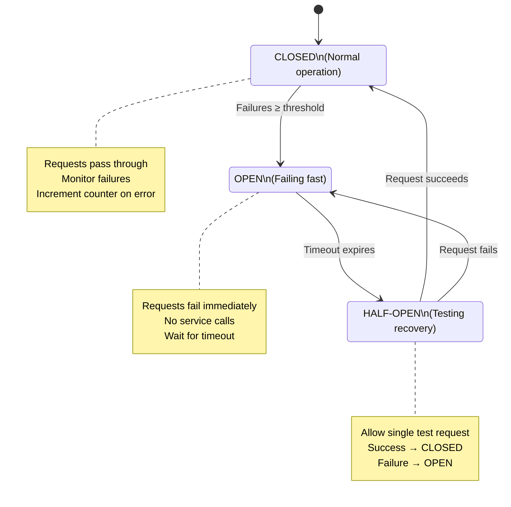

# Circuit Breaker Pattern

The application implements the **Circuit Breaker pattern** to prevent cascading failures when external services (Keycloak and Redis) become unavailable or slow. This resilience pattern protects your application from repeatedly attempting operations that are likely to fail.

## Overview

The circuit breaker acts as a proxy between your application and external services. It monitors failures and can temporarily "open" (block requests) when failure thresholds are exceeded, giving the failing service time to recover.

### Circuit Breaker States



**States:**

- **CLOSED (0)**: Normal operation - requests pass through
  - Circuit breaker monitors failures
  - Increments failure counter on each error
  - Opens when failure threshold (`fail_max`) is reached

- **OPEN (1)**: Circuit is open - requests fail fast
  - All requests immediately return error (no attempt to call service)
  - Prevents cascading failures and resource exhaustion
  - Automatic transition to HALF-OPEN after timeout period

- **HALF-OPEN (2)**: Testing recovery - limited requests allowed
  - Allows a single test request through
  - If successful → transition to CLOSED (service recovered)
  - If failure → transition back to OPEN (service still unhealthy)

## Protected Services

### Keycloak (Authentication)

**Protected Operations:**
- `keycloak_manager.login_async(username, password)` - User authentication
- Token validation and decoding

**Configuration:**
```python
KEYCLOAK_CIRCUIT_BREAKER_FAIL_MAX = 5  # Open after 5 consecutive failures
KEYCLOAK_CIRCUIT_BREAKER_TIMEOUT = 60  # Stay open for 60 seconds
```

**Behavior on Failure:**
- Circuit breaker opens after 5 failed login attempts
- Returns `None` or raises `CircuitBreakerError`
- Authentication fails gracefully (HTTP 401 or WebSocket permission denied)
- Application remains available for unauthenticated endpoints

### Redis (Caching & Rate Limiting)

**Protected Operations:**
- `get_redis_connection(db)` - Get Redis connection
- All rate limiting operations
- Token cache operations
- Session storage

**Configuration:**
```python
REDIS_CIRCUIT_BREAKER_FAIL_MAX = 3   # Open after 3 consecutive failures
REDIS_CIRCUIT_BREAKER_TIMEOUT = 30   # Stay open for 30 seconds
```

**Behavior on Failure:**
- Circuit breaker opens after 3 failed connection attempts
- Returns `None` from `get_redis_connection()`
- Rate limiting operates in fail-open mode (allows requests)
- Token caching falls back to direct token decode
- Application degrades gracefully without Redis

## Configuration

### Environment Variables

Add to your `.env` file:

```bash
# Enable/disable circuit breaker pattern (default: true)
CIRCUIT_BREAKER_ENABLED=true

# Keycloak circuit breaker settings
KEYCLOAK_CIRCUIT_BREAKER_FAIL_MAX=5   # Failures before opening
KEYCLOAK_CIRCUIT_BREAKER_TIMEOUT=60   # Seconds to stay open

# Redis circuit breaker settings
REDIS_CIRCUIT_BREAKER_FAIL_MAX=3      # Failures before opening
REDIS_CIRCUIT_BREAKER_TIMEOUT=30      # Seconds to stay open
```

### Tuning Guidelines

**`FAIL_MAX` (Failure Threshold):**
- **Lower values (2-3)**: Faster failure detection, more aggressive protection
  - Use for: Non-critical services, high-availability requirements
  - Risk: May open prematurely on transient errors

- **Higher values (5-10)**: More tolerance for transient failures
  - Use for: Critical services, unreliable networks
  - Risk: Longer cascading failure window

**`TIMEOUT` (Recovery Window):**
- **Shorter timeouts (10-30s)**: Faster recovery attempts
  - Use for: Services that recover quickly, low-traffic systems
  - Risk: May reopen circuit before service is fully recovered

- **Longer timeouts (60-120s)**: More time for service recovery
  - Use for: Services with slow recovery, high-traffic systems
  - Risk: Longer downtime if service recovers quickly

**Recommended Starting Values:**
```python
# Development
KEYCLOAK_CIRCUIT_BREAKER_FAIL_MAX=10  # More tolerance
KEYCLOAK_CIRCUIT_BREAKER_TIMEOUT=30   # Faster recovery

# Production
KEYCLOAK_CIRCUIT_BREAKER_FAIL_MAX=5   # Balanced
KEYCLOAK_CIRCUIT_BREAKER_TIMEOUT=60   # Conservative

REDIS_CIRCUIT_BREAKER_FAIL_MAX=3      # Fast detection
REDIS_CIRCUIT_BREAKER_TIMEOUT=30      # Standard window
```

## Monitoring

### Prometheus Metrics

The circuit breaker exposes three key metrics:

```promql
# Current circuit breaker state (0=closed, 1=open, 2=half_open)
circuit_breaker_state{service="keycloak"}
circuit_breaker_state{service="redis"}

# Total state changes (track flapping)
circuit_breaker_state_changes_total{service="keycloak",from_state="closed",to_state="open"}

# Total failures detected by circuit breaker
circuit_breaker_failures_total{service="keycloak"}
```

### Example Queries

**Check if any circuit breakers are open:**
```promql
circuit_breaker_state > 0
```

**Circuit breaker state changes in last hour:**
```promql
increase(circuit_breaker_state_changes_total[1h])
```

**Failure rate per minute:**
```promql
rate(circuit_breaker_failures_total[1m])
```

**Circuit breaker open duration:**
```promql
time() - (circuit_breaker_state == 1) * time()
```

### Grafana Dashboards

Circuit breaker metrics are visualized in the **FastAPI Metrics** dashboard:

- **Panel 28**: Circuit Breaker State (Timeseries)
  - Shows state transitions over time
  - Color-coded: Green (closed), Red (open), Yellow (half-open)

- **Panel 29**: Circuit Breaker Failures (Timeseries)
  - Tracks failure rates per service
  - Helps identify when services are unhealthy

- **Panel 30**: State Changes (Counter)
  - Total state transitions
  - High values indicate flapping (service instability)

Access: http://localhost:3000/d/fastapi-metrics

### Alerts

Prometheus alerts are configured in `docker/prometheus/alerts.yml`:

**`CircuitBreakerOpen` (Critical)**:
- Triggers when circuit breaker stays open > 2 minutes
- Indicates prolonged service unavailability
- Action: Check service health, review logs

**`CircuitBreakerFlapping` (Warning)**:
- Triggers when > 10 state changes in 5 minutes
- Indicates unstable service or misconfigured thresholds
- Action: Tune circuit breaker settings or investigate service

**`HighCircuitBreakerFailureRate` (Warning)**:
- Triggers when failure rate > 5/minute for 3 minutes
- Indicates service degradation
- Action: Monitor service, prepare for circuit opening

## Error Handling

### HTTP Endpoints

When a circuit breaker is open, HTTP endpoints return appropriate errors:

```python
from app.managers.keycloak_manager import keycloak_manager
from pybreaker import CircuitBreakerError

@router.post("/login")
async def login(credentials: Credentials):
    try:
        token = await keycloak_manager.login_async(
            credentials.username,
            credentials.password
        )
        return {"access_token": token["access_token"]}
    except CircuitBreakerError:
        # Circuit breaker is open - Keycloak unavailable
        raise HTTPException(
            status_code=503,
            detail="Authentication service temporarily unavailable"
        )
    except KeycloakAuthenticationError:
        # Invalid credentials
        raise HTTPException(
            status_code=401,
            detail="Invalid credentials"
        )
```

### WebSocket Handlers

Circuit breaker failures in WebSocket handlers return error responses:

```python
@pkg_router.register(PkgID.GET_AUTHORS)
async def get_authors(request: RequestModel) -> ResponseModel:
    redis = await get_redis_connection()

    if redis is None:
        # Circuit breaker open or Redis unavailable
        # Fallback: Continue without cache
        logger.warning("Redis unavailable, operating without cache")

    # Your logic here (graceful degradation)
    ...
```

### Client-Side Handling

**HTTP Clients:**
```javascript
async function login(username, password) {
    try {
        const response = await fetch('/api/login', {
            method: 'POST',
            body: JSON.stringify({ username, password })
        });

        if (response.status === 503) {
            // Circuit breaker open
            showError('Authentication service is temporarily unavailable. Please try again in a minute.');
            return null;
        }

        return await response.json();
    } catch (error) {
        showError('Network error. Please check your connection.');
        return null;
    }
}
```

**WebSocket Clients:**
```javascript
ws.onmessage = (event) => {
    const response = JSON.parse(event.data);

    if (response.status_code === 3) {  // PERMISSION_DENIED
        // May be due to circuit breaker on auth
        showError('Authentication failed. Service may be temporarily unavailable.');
        scheduleReconnect(60000);  // Retry in 60 seconds
    }
};
```

## Troubleshooting

### Circuit Breaker is Frequently Opening

**Symptoms:**
- Circuit breaker opens and closes repeatedly (flapping)
- Intermittent service unavailability
- High `circuit_breaker_state_changes_total` metric

**Possible Causes:**
1. **Service is actually unstable** - Investigate service logs and health
2. **Threshold too low** - Increase `FAIL_MAX` to tolerate transient errors
3. **Timeout too short** - Increase `TIMEOUT` to allow more recovery time
4. **Network issues** - Check network connectivity between services

**Resolution:**
```bash
# Increase tolerance for transient failures
KEYCLOAK_CIRCUIT_BREAKER_FAIL_MAX=10  # Was: 5
KEYCLOAK_CIRCUIT_BREAKER_TIMEOUT=90   # Was: 60

# Monitor and iterate
watch -n 5 'curl -s http://localhost:8000/metrics | grep circuit_breaker_state'
```

### Circuit Breaker Stays Open

**Symptoms:**
- Circuit breaker remains in OPEN state
- Service appears healthy but circuit won't close
- Continuous 503 errors

**Possible Causes:**
1. **Service is still unhealthy** - Service returning errors during recovery tests
2. **Timeout not expired** - Circuit hasn't attempted recovery yet
3. **Health check failing** - Service responds but returns errors

**Resolution:**
```bash
# Check service health directly
curl -I http://hw-keycloak:8080/health  # Keycloak
redis-cli -h hw-redis PING              # Redis

# Check circuit breaker state
curl -s http://localhost:8000/metrics | grep 'circuit_breaker_state{service="keycloak"}'

# Wait for timeout period to elapse
# Circuit will auto-transition to HALF-OPEN and test recovery

# If persistent, restart application to reset circuit breaker state
docker restart hw-server-shell
```

### Circuit Breaker Never Opens (Should Open)

**Symptoms:**
- Service is clearly failing but circuit breaker stays CLOSED
- Application continues attempting failed operations
- High error rates without circuit breaker opening

**Possible Causes:**
1. **Circuit breaker disabled** - `CIRCUIT_BREAKER_ENABLED=false`
2. **Threshold too high** - `FAIL_MAX` set too high
3. **Success responses** - Service returning 200 but with errors in payload
4. **Exceptions not raised** - Errors handled before reaching circuit breaker

**Resolution:**
```bash
# Verify circuit breaker is enabled
echo $CIRCUIT_BREAKER_ENABLED  # Should be "true"

# Lower threshold for testing
KEYCLOAK_CIRCUIT_BREAKER_FAIL_MAX=2  # Very sensitive

# Check error propagation in code
# Ensure exceptions reach circuit breaker layer
```

### Monitoring Circuit Breaker Health

**Real-time monitoring:**
```bash
# Watch circuit breaker state
watch -n 1 'curl -s http://localhost:8000/metrics | grep circuit_breaker'

# Check failure counts
curl -s http://localhost:8000/metrics | grep circuit_breaker_failures_total

# Check state changes
curl -s http://localhost:8000/metrics | grep circuit_breaker_state_changes_total
```

**Log monitoring:**
```bash
# Watch for circuit breaker events
docker logs -f hw-server-shell | grep -i "circuit breaker"

# Expected log messages:
# - "Keycloak circuit breaker initialized (fail_max=5, timeout=60s)"
# - "Redis circuit breaker initialized (fail_max=3, timeout=30s)"
# - "Keycloak circuit breaker failure: [error details]"
# - "Keycloak circuit breaker state changed: closed → open"
```

## Best Practices

### 1. Monitor Circuit Breaker Metrics

Set up alerts for circuit breaker events:
- Alert when circuit stays open > 2 minutes (service down)
- Alert on excessive state changes (service flapping)
- Track failure rates to predict circuit openings

### 2. Implement Graceful Degradation

Design your application to continue functioning when circuits are open:

```python
# Good: Graceful degradation
redis = await get_redis_connection()
if redis is None:
    # Continue without cache
    results = await db.query(...)
else:
    # Try cache first
    cached = await redis.get(cache_key)
    if cached:
        return cached
    results = await db.query(...)
    await redis.set(cache_key, results)

return results
```

```python
# Bad: Hard failure
redis = await get_redis_connection()
cached = await redis.get(cache_key)  # Fails if redis is None
```

### 3. Tune for Your Traffic Patterns

- **Low traffic**: Use higher `FAIL_MAX` (avoid premature opens on single failures)
- **High traffic**: Use lower `FAIL_MAX` (detect failures faster)
- **Stable services**: Use longer `TIMEOUT` (allow full recovery)
- **Unstable services**: Use shorter `TIMEOUT` (retry sooner)

### 4. Test Circuit Breaker Behavior

Regularly test circuit breaker behavior in staging:

```bash
# Simulate Keycloak failure
docker stop hw-keycloak

# Watch circuit breaker open
watch -n 1 'curl -s http://localhost:8000/metrics | grep circuit_breaker_state'

# Verify application continues functioning
curl http://localhost:8000/health  # Should return 200

# Restore service
docker start hw-keycloak

# Verify circuit closes after timeout
```

### 5. Log Circuit Breaker Events

Circuit breaker events are automatically logged:
- State changes (CLOSED → OPEN → HALF-OPEN → CLOSED)
- Failure events
- Circuit breaker initialization

Review logs regularly to understand failure patterns.

### 6. Combine with Other Patterns

Circuit breaker works best with complementary patterns:
- **Retry logic**: Retry before circuit breaker opens
- **Timeouts**: Set reasonable timeouts to avoid long waits
- **Bulkheads**: Isolate failures to prevent full system impact
- **Fallbacks**: Provide alternative behavior when circuit is open

## Production Checklist

Before deploying to production:

- [ ] Circuit breaker enabled (`CIRCUIT_BREAKER_ENABLED=true`)
- [ ] Thresholds tuned for your traffic (`FAIL_MAX`, `TIMEOUT`)
- [ ] Grafana dashboard panels configured for circuit breaker metrics
- [ ] Prometheus alerts set up for circuit breaker states
- [ ] Application implements graceful degradation when circuits are open
- [ ] Client error handling accounts for 503 (Service Unavailable) responses
- [ ] Load testing performed with circuit breaker enabled
- [ ] Runbook created for responding to circuit breaker alerts
- [ ] Circuit breaker behavior tested in staging environment
- [ ] Logging and monitoring verified for circuit breaker events

## Additional Resources

- **pybreaker Documentation**: https://github.com/danielfm/pybreaker
- **Circuit Breaker Pattern**: https://martinfowler.com/bliki/CircuitBreaker.html
- **Resilience Patterns**: https://learn.microsoft.com/en-us/azure/architecture/patterns/circuit-breaker
- **FastAPI Metrics Dashboard**: http://localhost:3000/d/fastapi-metrics
- **Prometheus Alerts**: http://localhost:9090/alerts
