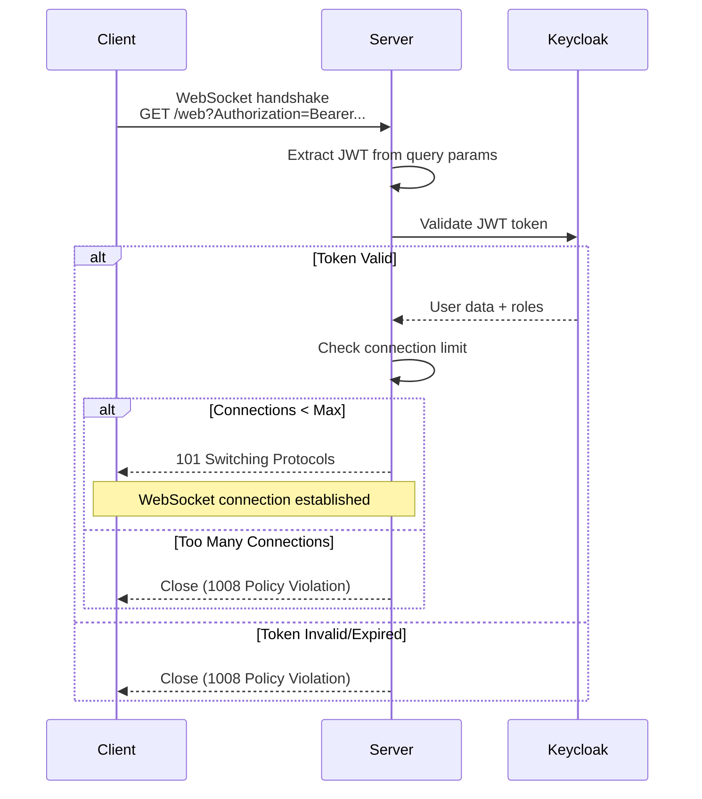
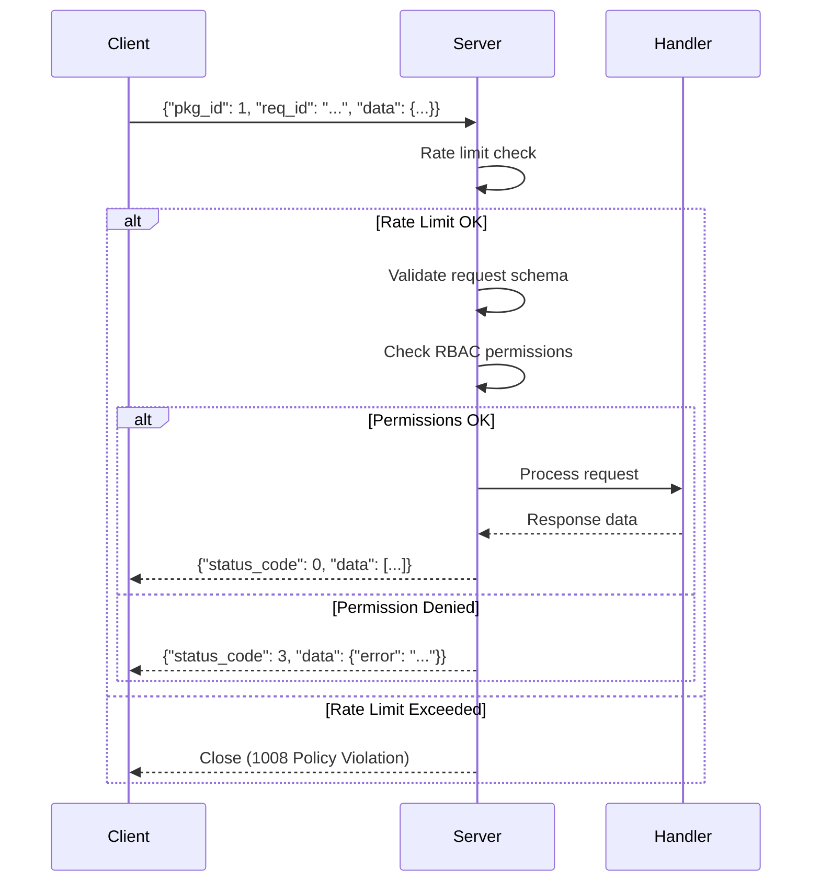
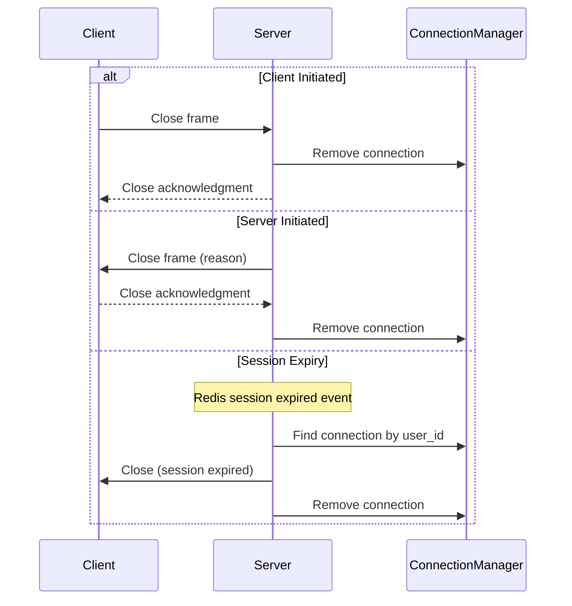

# WebSocket Protocol Specification

This document provides a comprehensive specification of the WebSocket API protocol for client developers implementing WebSocket clients in any programming language.

## Table of Contents

- [Connection URL](#connection-url)
- [Message Format](#message-format)
- [Status Codes (RSPCode)](#status-codes-rspcode)
- [Available Package IDs (PkgID)](#available-package-ids-pkgid)
- [Connection Lifecycle](#connection-lifecycle)
- [Authentication Flow](#authentication-flow)
- [Error Handling](#error-handling)
- [Rate Limiting](#rate-limiting)
- [Best Practices](#best-practices)

## Connection URL

### WebSocket Endpoint

```
ws://localhost:8000/web?Authorization=Bearer%20{token}&format=json
```

**Production** (with TLS):
```
wss://api.example.com/web?Authorization=Bearer%20{token}&format=json
```

### Query Parameters

| Parameter | Required | Type | Description | Example |
|-----------|----------|------|-------------|---------|
| `Authorization` | Yes | string | URL-encoded Bearer token | `Bearer%20eyJhbGc...` |
| `format` | No | string | Message format: `json` (default) or `protobuf` | `json` |

**Important**: The `Authorization` parameter must be URL-encoded. In JavaScript:

```javascript
const token = 'eyJhbGc...';
const encoded = encodeURIComponent(`Bearer ${token}`);
const url = `ws://localhost:8000/web?Authorization=${encoded}`;
```

## Message Format

### JSON Format (Default)

#### Request Message

Clients send requests in the following JSON format:

```json
{
  "pkg_id": 1,
  "req_id": "550e8400-e29b-41d4-a716-446655440000",
  "data": {
    "page": 1,
    "per_page": 20,
    "filters": {"status": "active"}
  }
}
```

**Field Descriptions:**

| Field | Type | Required | Description |
|-------|------|----------|-------------|
| `pkg_id` | integer | Yes | Package identifier (see [Available Package IDs](#available-package-ids-pkgid)) |
| `req_id` | string (UUID) | Yes | Unique request identifier for correlating requests/responses |
| `data` | object | Yes | Request payload (schema varies by pkg_id) |

#### Response Message

Server responds with the following JSON format:

```json
{
  "pkg_id": 1,
  "req_id": "550e8400-e29b-41d4-a716-446655440000",
  "status_code": 0,
  "data": [
    {"id": 1, "name": "John Doe"},
    {"id": 2, "name": "Jane Smith"}
  ],
  "meta": {
    "page": 1,
    "per_page": 20,
    "total": 100,
    "pages": 5,
    "next_cursor": null,
    "has_more": false
  }
}
```

**Field Descriptions:**

| Field | Type | Required | Description |
|-------|------|----------|-------------|
| `pkg_id` | integer | Yes | Same as request pkg_id |
| `req_id` | string (UUID) | Yes | Same as request req_id |
| `status_code` | integer | Yes | Response status code (see [Status Codes](#status-codes-rspcode)) |
| `data` | any | Yes | Response payload (type varies by pkg_id) |
| `meta` | object \| null | No | Pagination metadata (for list endpoints) |

#### Error Response

When an error occurs, the response contains error details:

```json
{
  "pkg_id": 1,
  "req_id": "550e8400-e29b-41d4-a716-446655440000",
  "status_code": 3,
  "data": {"error": "Permission denied: missing required role 'get-authors'"},
  "meta": null
}
```

### Protobuf Format (Optional)

For better performance and smaller message sizes, clients can use Protocol Buffers by setting `format=protobuf` in the connection URL.

**Benefits of Protobuf:**
- 30-50% smaller message size
- 2-5x faster serialization/deserialization
- Strong typing with schema validation

See [examples/clients/websocket_protobuf_client.py](../../examples/clients/websocket_protobuf_client.py) for implementation.

## Status Codes (RSPCode)

The server uses the following status codes to indicate request outcomes:

| Code | Name | Description | HTTP Equivalent |
|------|------|-------------|-----------------|
| 0 | OK | Request successful | 200 OK |
| 1 | ERROR | General error occurred | 500 Internal Server Error |
| 2 | INVALID_DATA | Invalid or malformed request data | 400 Bad Request |
| 3 | PERMISSION_DENIED | User lacks required permissions | 403 Forbidden |

**Example error handling:**

```javascript
const response = await client.request(pkgId, data);

if (response.status_code === 0) {
  // Success
  console.log('Data:', response.data);
} else if (response.status_code === 3) {
  // Permission denied
  console.error('Access denied:', response.data.error);
} else if (response.status_code === 2) {
  // Invalid data
  console.error('Validation error:', response.data.error);
} else {
  // General error
  console.error('Server error:', response.data.error);
}
```

## Available Package IDs (PkgID)

Package IDs identify different WebSocket handler operations. Each PkgID has specific request/response schemas and required roles.

| PkgID | Name | Description | Roles Required | Request Schema | Response Type |
|-------|------|-------------|----------------|----------------|---------------|
| 1 | GET_AUTHORS | Get all authors | `get-authors` | `{filters?: object}` | `Author[]` |
| 2 | GET_PAGINATED_AUTHORS | Get paginated authors | `get-authors` | `{page: number, per_page: number, filters?: object}` | `Author[]` with `meta` |
| 3 | CREATE_AUTHOR | Create new author | `create-author` | `{name: string}` | `Author` |

### Author Schema

```typescript
interface Author {
  id: number;
  name: string;
}
```

### Pagination Metadata

```typescript
interface PaginationMeta {
  page: number;           // Current page number
  per_page: number;       // Items per page
  total: number;          // Total number of items
  pages: number;          // Total number of pages
  next_cursor: string | null;  // Cursor for next page (cursor pagination)
  has_more: boolean;      // Whether more results exist
}
```

## Connection Lifecycle

### 1. Connection Establishment



### 2. Message Exchange



### 3. Connection Termination



## Authentication Flow

### Token-Based Authentication

WebSocket connections authenticate using JWT tokens in the query string (browser WebSocket API limitation).

**Security Considerations:**

⚠️ **Always use WSS (WebSocket over TLS) in production** to protect tokens in transit.

**Token Requirements:**
- Valid Keycloak JWT access token
- Not expired (default: 5 minutes)
- Contains required roles for requested operations

**Best Practices:**

1. **Get fresh token before connecting:**
```javascript
// Get fresh token immediately before WebSocket connection
const token = await getAccessToken();
const ws = new WebSocket(`wss://api.example.com/web?Authorization=${encodeURIComponent('Bearer ' + token)}`);
```

2. **Reconnect before token expiration:**
```javascript
// Reconnect every 4 minutes (before 5-minute expiry)
setInterval(async () => {
  ws.close();
  const newToken = await refreshAccessToken();
  ws = new WebSocket(`wss://api.example.com/web?Authorization=${encodeURIComponent('Bearer ' + newToken)}`);
}, 4 * 60 * 1000);
```

3. **Never log tokens:**
```javascript
// ❌ Bad - logs token
console.log('Connecting to:', wsUrl);

// ✅ Good - logs without token
console.log('WebSocket connecting...');
```

## Error Handling

### Common Error Scenarios

#### 1. Authentication Errors

**Scenario**: Invalid or expired JWT token

**Server Response**: Connection closed with code 1008 (Policy Violation)

**Client Handling**:
```javascript
ws.onerror = (error) => {
  console.error('Connection error:', error);
  // Refresh token and retry
  refreshTokenAndReconnect();
};

ws.onclose = (event) => {
  if (event.code === 1008) {
    console.error('Authentication failed - invalid or expired token');
    // Redirect to login or refresh token
  }
};
```

#### 2. Rate Limit Exceeded

**Scenario**: Client sends too many messages

**Server Response**: Connection closed with code 1008

**Client Handling**:
```javascript
// Implement client-side rate limiting
class RateLimitedWebSocket {
  constructor(url, maxMessagesPerMinute = 100) {
    this.ws = new WebSocket(url);
    this.maxMessages = maxMessagesPerMinute;
    this.messageTimestamps = [];
  }

  send(data) {
    const now = Date.now();
    this.messageTimestamps = this.messageTimestamps.filter(
      t => now - t < 60000
    );

    if (this.messageTimestamps.length >= this.maxMessages) {
      throw new Error('Rate limit exceeded');
    }

    this.messageTimestamps.push(now);
    this.ws.send(data);
  }
}
```

#### 3. Permission Denied

**Scenario**: User lacks required role

**Server Response**:
```json
{
  "status_code": 3,
  "data": {"error": "Permission denied: missing required role 'create-author'"}
}
```

**Client Handling**:
```javascript
if (response.status_code === 3) {
  // Hide UI elements requiring this permission
  document.getElementById('create-button').style.display = 'none';
  showNotification('You do not have permission to perform this action');
}
```

#### 4. Invalid Request Data

**Scenario**: Malformed or invalid request payload

**Server Response**:
```json
{
  "status_code": 2,
  "data": {"error": "Validation error: 'name' is required"}
}
```

**Client Handling**:
```javascript
if (response.status_code === 2) {
  // Show validation errors to user
  showValidationError(response.data.error);
}
```

## Rate Limiting

### Connection Limits

- **Max concurrent connections per user**: 5 (configurable via `WS_MAX_CONNECTIONS_PER_USER`)
- **Enforcement**: New connections rejected if limit exceeded

### Message Rate Limits

- **Max messages per minute**: 100 (configurable via `WS_MESSAGE_RATE_LIMIT`)
- **Enforcement**: Connection closed if limit exceeded

**Client-side rate limiting:**
```javascript
class RateLimiter {
  constructor(maxPerMinute) {
    this.max = maxPerMinute;
    this.timestamps = [];
  }

  canSend() {
    const now = Date.now();
    this.timestamps = this.timestamps.filter(t => now - t < 60000);
    return this.timestamps.length < this.max;
  }

  recordSend() {
    this.timestamps.push(Date.now());
  }
}
```

## Best Practices

### 1. Request ID Generation

Always use UUIDs (v4) for request IDs:

```javascript
// ✅ Good - UUID v4
const reqId = crypto.randomUUID();

// ❌ Bad - sequential IDs (collision risk)
const reqId = `${Date.now()}-${Math.random()}`;
```

### 2. Timeout Handling

Implement request timeouts to handle unresponsive servers:

```javascript
class WebSocketClient {
  async request(pkgId, data, timeout = 30000) {
    const reqId = crypto.randomUUID();

    return new Promise((resolve, reject) => {
      const timeoutId = setTimeout(() => {
        this.pendingRequests.delete(reqId);
        reject(new Error('Request timeout'));
      }, timeout);

      this.pendingRequests.set(reqId, { resolve, reject, timeoutId });

      this.ws.send(JSON.stringify({ pkg_id: pkgId, req_id: reqId, data }));
    });
  }
}
```

### 3. Reconnection Strategy

Implement exponential backoff for reconnection:

```javascript
class ReconnectingWebSocket {
  connect(attempt = 0) {
    this.ws = new WebSocket(this.url);

    this.ws.onerror = () => {
      const delay = Math.min(1000 * Math.pow(2, attempt), 30000);
      console.log(`Reconnecting in ${delay}ms...`);
      setTimeout(() => this.connect(attempt + 1), delay);
    };
  }
}
```

### 4. Graceful Shutdown

Clean up resources on disconnect:

```javascript
window.addEventListener('beforeunload', () => {
  ws.close(1000, 'Client closing');
});
```

### 5. Message Validation

Validate responses before processing:

```javascript
function validateResponse(response) {
  if (!response || typeof response !== 'object') {
    throw new Error('Invalid response format');
  }

  if (!('pkg_id' in response) || !('req_id' in response) || !('status_code' in response)) {
    throw new Error('Missing required response fields');
  }

  return response;
}
```

## Related Documentation

- [WebSocket Handlers Guide](websocket-handlers.md) - Implementing server-side handlers
- [WebSocket API Reference](../api-reference/websocket-api.md) - Detailed API documentation
- [Authentication Guide](authentication.md) - Keycloak integration and token management
- [Rate Limiting Guide](rate-limiting.md) - Rate limiting configuration

## Troubleshooting

### Connection Refused

**Problem**: Cannot establish WebSocket connection

**Solutions**:
1. Check server is running: `curl http://localhost:8000/health`
2. Verify WebSocket endpoint: `ws://localhost:8000/web` (not `/ws` or `/websocket`)
3. Ensure token is properly URL-encoded

### Connection Closes Immediately

**Problem**: Connection closes right after opening

**Solutions**:
1. Check token validity: Decode JWT and verify expiration
2. Verify user has required roles for initial connection
3. Check server logs for authentication errors
4. Ensure connection limit not exceeded

### No Response to Messages

**Problem**: Server doesn't respond to requests

**Solutions**:
1. Verify `pkg_id` is valid (see [Available Package IDs](#available-package-ids-pkgid))
2. Check request data matches expected schema
3. Ensure user has required roles for the operation
4. Look for rate limiting (connection closes after timeout)

### "Invalid JSON" Errors

**Problem**: Server rejects messages with JSON parse errors

**Solutions**:
1. Ensure message is valid JSON: `JSON.parse(message)`
2. Verify required fields are present: `pkg_id`, `req_id`, `data`
3. Check data types match schema (numbers vs strings)
