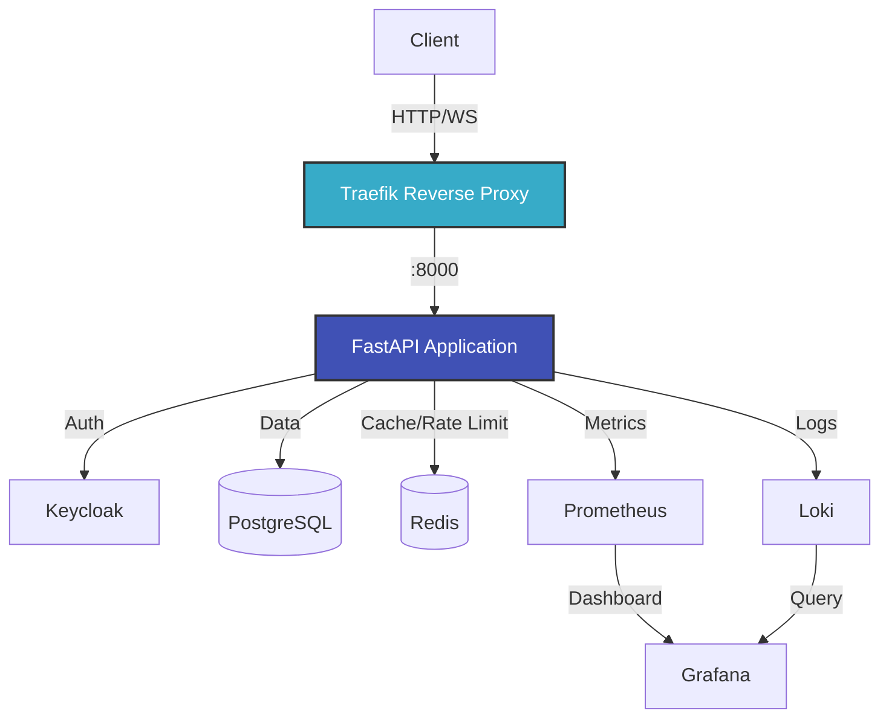

# FastAPI HTTP/WebSocket Template

A production-ready FastAPI template with comprehensive HTTP and WebSocket support, including authentication, RBAC, rate limiting, audit logging, and monitoring.

<div class="grid cards" markdown>

-   :material-clock-fast:{ .lg .middle } __Quick Start__

    ---

    Get up and running in 5 minutes

    [:octicons-arrow-right-24: Getting Started](getting-started/quickstart.md)

-   :material-rocket-launch:{ .lg .middle } __Production Ready__

    ---

    Deploy to production with confidence

    [:octicons-arrow-right-24: Deployment Guide](deployment/production.md)

-   :material-security:{ .lg .middle } __Secure by Default__

    ---

    Built-in authentication, RBAC, and rate limiting

    [:octicons-arrow-right-24: Security Guide](deployment/security.md)

-   :material-chart-line:{ .lg .middle } __Observable__

    ---

    Prometheus metrics, Grafana dashboards, and structured logging

    [:octicons-arrow-right-24: Monitoring Guide](deployment/monitoring.md)

</div>

## Features

### Dual Protocol Support
- ✅ **HTTP REST API** - FastAPI-powered REST endpoints with OpenAPI documentation
- ✅ **WebSocket Handlers** - Package-based WebSocket routing with JSON message format
- ✅ **Unified Business Logic** - Share code between protocols using Repository + Command pattern

### Authentication & Authorization
- ✅ **Keycloak Integration** - Enterprise-grade authentication with JWT tokens
- ✅ **RBAC System** - Decorator-based role access control co-located with handlers
- ✅ **Token Validation** - Automatic token verification and user extraction
- ✅ **Session Management** - Redis-backed session tracking

### Rate Limiting & Security
- ✅ **HTTP Rate Limiting** - Sliding window algorithm per user/IP
- ✅ **WebSocket Rate Limiting** - Connection and message rate limits
- ✅ **Redis-Backed** - Distributed rate limiting across instances
- ✅ **Configurable Limits** - Per-endpoint and per-user limits

### Database & Persistence
- ✅ **PostgreSQL** - Async SQLModel/SQLAlchemy integration
- ✅ **Database Migrations** - Alembic for schema versioning
- ✅ **Connection Pooling** - Optimized connection management
- ✅ **Repository Pattern** - Testable data access layer

### Monitoring & Observability
- ✅ **Prometheus Metrics** - HTTP/WebSocket request metrics, database queries, rate limits
- ✅ **Grafana Dashboards** - Pre-built dashboards for FastAPI, Keycloak, and logs
- ✅ **Structured Logging** - JSON logs with correlation IDs
- ✅ **Loki Integration** - Centralized log aggregation

### Audit & Compliance
- ✅ **User Action Logging** - Track all user actions with context
- ✅ **Async Queue Processing** - Non-blocking audit log writes
- ✅ **Searchable Logs** - Query audit trail with filters
- ✅ **Retention Policies** - Configurable log retention

### Developer Experience
- ✅ **Type Safety** - Full mypy --strict compliance
- ✅ **Code Quality** - Pre-commit hooks with ruff, mypy, interrogate
- ✅ **Testing** - Pytest with async support, 66% coverage
- ✅ **Docker Support** - Full development environment via docker-compose
- ✅ **Hot Reload** - Uvicorn auto-reload during development

## Architecture



## Quick Example

### HTTP Endpoint

```python
from fastapi import APIRouter, Depends
from app.dependencies import AuthorRepoDep
from app.commands.author_commands import CreateAuthorCommand
from app.schemas.author import CreateAuthorInput

router = APIRouter()

@router.post("/authors")
async def create_author(
    data: CreateAuthorInput,
    repo: AuthorRepoDep
) -> Author:
    """Create a new author."""
    command = CreateAuthorCommand(repo)
    return await command.execute(data)
```

### WebSocket Handler

```python
from app.routing import pkg_router
from app.api.ws.constants import PkgID
from app.schemas.models import RequestModel, ResponseModel

@pkg_router.register(PkgID.GET_AUTHORS)
async def get_authors(request: RequestModel) -> ResponseModel:
    """Get list of authors via WebSocket."""
    async with async_session() as session:
        repo = AuthorRepository(session)
        authors = await repo.get_all()

        return ResponseModel.success(
            request.pkg_id,
            request.req_id,
            data=[a.model_dump() for a in authors]
        )
```

## Use Cases

This template is ideal for applications requiring:

- **Real-time Communication** - Chat apps, live dashboards, collaborative tools
- **IoT/Device Management** - Device telemetry, command & control
- **Trading/Financial** - Order management, market data streaming
- **Gaming** - Multiplayer game servers, lobby systems
- **Monitoring** - Real-time alerts, log streaming

## Technology Stack

| Component | Technology | Purpose |
|-----------|------------|---------|
| **Web Framework** | FastAPI 0.121+ | High-performance async API framework |
| **ASGI Server** | Uvicorn | Production ASGI server |
| **Database** | PostgreSQL 13+ | Primary data store |
| **ORM** | SQLModel | Type-safe database models |
| **Cache/Queue** | Redis 7+ | Rate limiting, sessions, caching |
| **Authentication** | Keycloak | Enterprise SSO and identity management |
| **Reverse Proxy** | Traefik v3 | Load balancing, SSL termination |
| **Metrics** | Prometheus | Time-series metrics collection |
| **Dashboards** | Grafana | Visualization and alerting |
| **Logging** | Loki + Grafana Alloy | Log aggregation and querying |
| **Container** | Docker + Compose | Development and deployment |

## Project Status

- ✅ **Production Ready** - Battle-tested patterns and best practices
- ✅ **Type Safe** - Full mypy compliance with strict mode
- ✅ **Well Tested** - 66% coverage (target: 80%+)
- ✅ **Documented** - Comprehensive guides and API reference
- ✅ **Observable** - Full monitoring and logging stack
- ✅ **Secure** - Authentication, RBAC, rate limiting, audit logs

## Next Steps

<div class="grid cards" markdown>

-   **New to the project?**

    Start with the [Installation Guide](getting-started/installation.md) to set up your development environment.

-   **Ready to build?**

    Follow the [Quick Start](getting-started/quickstart.md) to create your first endpoints.

-   **Deploying to production?**

    Check out the [Production Deployment Guide](deployment/production.md).

-   **Want to contribute?**

    Read the [Contributing Guide](development/contributing.md) to get started.

</div>

## License

This project is licensed under the MIT License - see the LICENSE file for details.

## Support

- 📖 [Documentation](https://acikabubo.github.io/fastapi-http-websocket/)
- 🐛 [Issue Tracker](https://github.com/acikabubo/fastapi-http-websocket/issues)
- 💬 [Discussions](https://github.com/acikabubo/fastapi-http-websocket/discussions)
