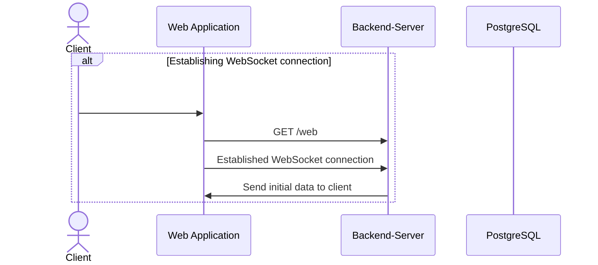
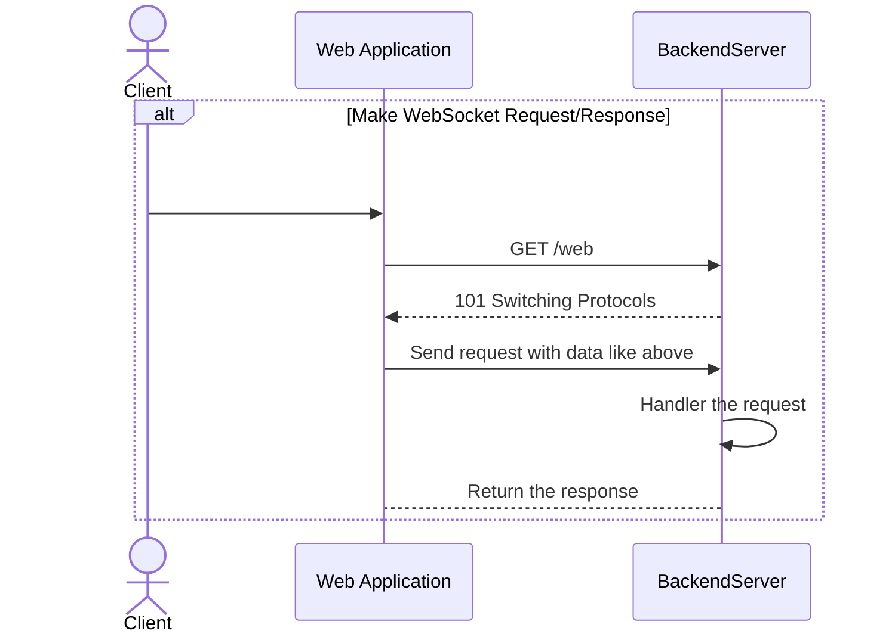
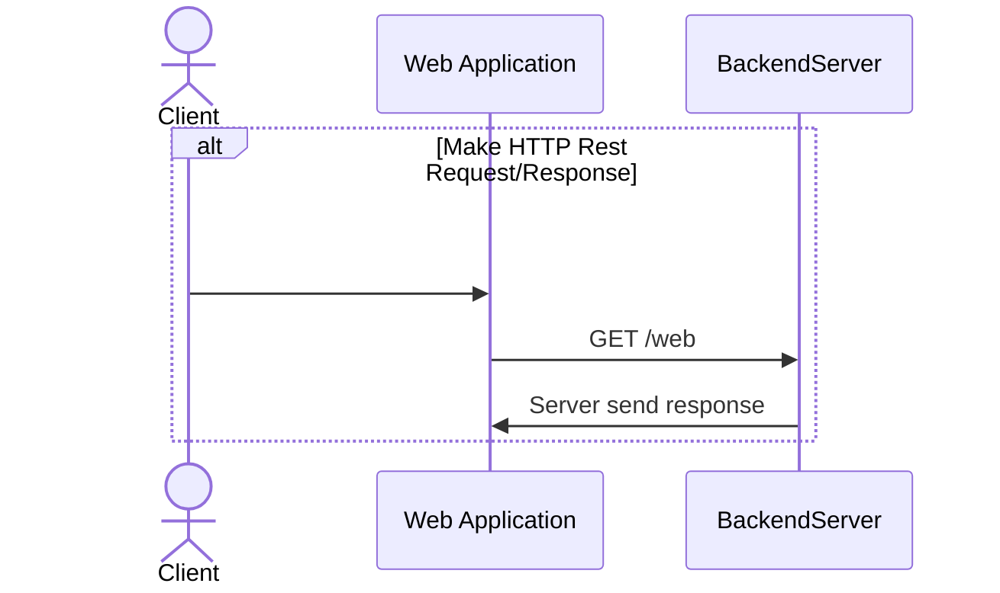

# Project generate

cookiecutter --overwrite-if-exists <path-of-cookiecutter-template>

# Authentication

TODO

# Authorization

TODO

# Managers

## Websocket connection manager

TODO

## Keycloak manager

TODO

# API and WS handers documentation

## Establish WebSocket conenction



## Make WebSocket Request/Response

### Request data format

#### Regular request data
```json
{
    "pkg_id": "<int>",
    "req_id": "<uuid>",
    "data": {...}
}
```

#### Request for paginated data
```json
{
    "pkg_id": "<int>",
    "req_id": "<uuid>",
}

Without pagination params default are page=1 and per_page=20

{
    "pkg_id": 2,
    "req_id": "<uuid>",
    "data": {
        "page": 1,
        "per_page": 5
    }
}
```


### Response data format

#### Response for regular request
```json
{
    "pkg_id": "Same <int> like request",
    "req_id": "Same <UUID> like request",
    "status": 0,
    "data": {...}
}
```

#### Response for paginated request
```json
{
    "pkg_id": "Same <int> like request",
    "req_id": "Same <UUID> like request",
    "status_code": 0,
    "meta": {
        "page": 1,
        "per_page": 20,
        "total": 4,
        "pages": 1
    },
    "data": [...]
}
```

```json
{
    "pkg_id": "Same <int> like request",
    "req_id": "Same <UUID> like request",
    "status_code": 0,
    "meta": {
        "page": 1,
        "per_page": 5,
        "total": 4,
        "pages": 1
    },
    "data": [...]
}
```



## Make HTTP Request/Response


